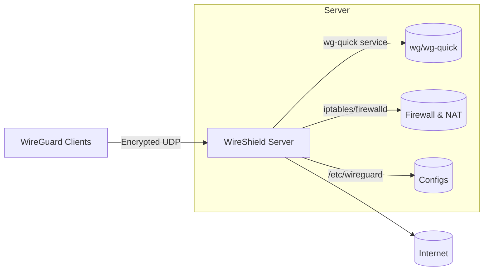
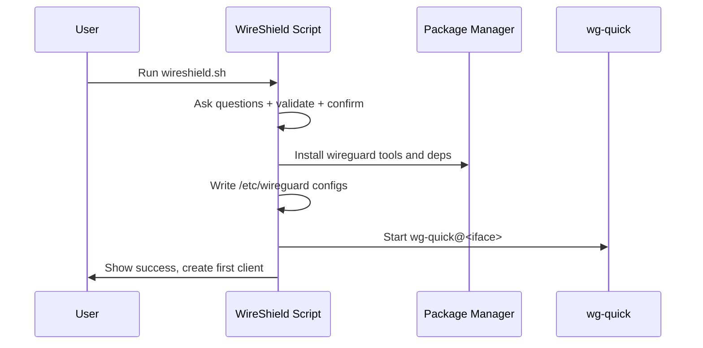

<div align="center">

# WireShield

[](https://opensource.org/licenses/MIT)
[](https://www.gnu.org/software/bash/)
[](https://www.wireguard.com/)

Secure, modern, one-command WireGuard VPN installer and manager for Linux.

<sub>Simple to use. Sensible defaults. Production-friendly.</sub>

</div>

## Overview

WireShield is a single-file bash tool that installs and manages a [WireGuard](https://www.wireguard.com/) VPN server in minutes. It sets up a secure tunnel so clients can route traffic through your server (full-tunnel or split-tunnel), with automatic firewalling and IPv4/IPv6 support.

Highlights:

- One-command install with interactive prompts and a final confirmation summary
- Kernel-aware: built-in WireGuard on Linux 5.6+, module install on older kernels
- Dual-stack networking (IPv4 and IPv6)
- Hardened defaults and tight file permissions
- Interactive client management (add/list/revoke), status, restart, backup
- Optional QR codes for mobile onboarding; optional TUI (whiptail) when installed


## Table of contents

- [Overview](#overview)
- [Supported platforms](#supported-platforms)
- [Quick start](#quick-start)
- [Usage](#usage)
- [Architecture](#architecture)
- [Configuration details](#configuration-details)
- [Security considerations](#security-considerations)
- [Troubleshooting](#troubleshooting)
- [Uninstall](#uninstall)
- [FAQ](#faq)
- [Contributing](#contributing)
- [License](#license)
- [Acknowledgements](#acknowledgements)

## Supported platforms

WireShield supports these Linux distributions out of the box:

- AlmaLinux ≥ 8
- Alpine Linux
- Arch Linux
- CentOS Stream ≥ 8
- Debian ≥ 10
- Fedora ≥ 32
- Oracle Linux
- Rocky Linux ≥ 8
- Ubuntu ≥ 18.04
## Quick start

Download and run the script as root (or with sudo):

```bash
wget https://raw.githubusercontent.com/siyamsarker/WireShield/master/wireshield.sh -O wireshield.sh
chmod +x wireshield.sh
sudo ./wireshield.sh
```

You’ll be asked a few questions (address/hostname, public NIC, wg interface, IPs, port, DNS, AllowedIPs). A summary is shown at the end—confirm to proceed. WireShield will install WireGuard, configure the server, enable forwarding, set firewall rules, and create your first client.

## Usage

After installation, rerun the script anytime to open the interactive menu:

```
1) Add a new client
2) List clients
3) Show QR for a client
4) Revoke existing client
5) Show server status
6) Restart WireGuard
7) Backup configuration
8) Uninstall WireGuard
9) Exit
```

Notes:

- If `whiptail` is present, you'll get a dialog-based UI; otherwise, a clean CLI menu.
- Client files are written in two forms for convenience: `wg0-client-<name>.conf` and `<name>.conf`.
- Uninstall performs a single confirmation and removes server config and detected client `.conf` files under `/root` and `/home`.

## Architecture



Install flow (high level):



## Configuration details

- Files and paths
  - Server config: `/etc/wireguard/<interface>.conf` (0600)
  - Global params: `/etc/wireguard/params`
  - Client configs: user home (e.g., `/root`, `/home/<user>`)
  - Sysctl settings: `/etc/sysctl.d/wg.conf`

- Firewall rules
  - firewalld: zones and rich rules for NAT/masquerade are applied automatically
  - iptables: INPUT/FORWARD/POSTROUTING rules for the selected UDP port and interface

- Client routing (AllowedIPs)
  - Default is `0.0.0.0/0,::/0` (full tunnel). Set a narrower range for split tunnel.

- DNS
  - Specify preferred DNS resolvers during install; clients inherit these.

- MTU
  - You can set a custom MTU in client configs if needed (comment provided in file).

## Security considerations

- Runs with root privileges by design (network stack, firewall, sysctl, and `/etc/wireguard`).
- Generates fresh key pairs and pre-shared keys per client.
- Restricts config permissions to 0600.
- Minimizes system changes to the necessary interface, port, and forwarding settings.

## Troubleshooting

- Port and connectivity
  - Ensure the chosen UDP port is open in provider firewalls/security groups and any local firewall.
  - UFW example:
    ```bash
    sudo ufw allow <your_port>/udp
    sudo ufw reload
    ```

- Service status and peers
  - Check service status:
    ```bash
    sudo systemctl status wg-quick@wg0
    ```
  - Show live peers/handshakes:
    ```bash
    sudo wg show
    ```

- Kernel and module
  - WireGuard is built into Linux 5.6+. On older kernels the module is installed.
  - Verify:
    ```bash
    uname -r
    wg --version
    ```
  - If you see “Cannot find device wg0”, reboot the server first.

- No internet on client
  - Reboot the server after kernel or package updates.
  - Confirm forwarding:
    ```bash
    sysctl net.ipv4.ip_forward net.ipv6.conf.all.forwarding
    ```
  - Try setting a lower MTU (e.g., 1420) in the client config if you suspect fragmentation.

- QR code not shown
  - Ensure `qrencode` is installed (the installer attempts this automatically when available).

<details>
<summary>More tips</summary>

- Endpoint hostname vs IP
  - You can use a hostname for the public address; ensure DNS resolves correctly from clients.

- Double NAT scenarios
  - If your server sits behind NAT, ensure UDP port forwarding is configured on the upstream router.

- Split tunnel examples
  - For office subnets only, set AllowedIPs to e.g. `10.0.0.0/8,192.168.0.0/16` instead of default `0.0.0.0/0,::/0`.

</details>

## Uninstall

From the menu, choose "Uninstall WireGuard". The script will stop the service, remove packages and `/etc/wireguard`, reload sysctl, and remove detected client `.conf` files from `/root` and `/home`.

## FAQ

- Can I reuse a client name after revoking?
  - Yes. Revoking removes the peer and its `.conf` files, allowing name reuse.

- Where are client configs saved?
  - In the invoking user's home (root or sudo user), typically `/root` or `/home/<user>`.

- Do I need IPv6?
  - No. Dual-stack is supported. You can use IPv4 only if you prefer.

## Contributing

We welcome contributions from the community! Whether you're reporting bugs, suggesting features, or submitting code, your help makes WireShield better.

### Reporting bugs

If you encounter a bug or unexpected behavior:

1. Check the [Troubleshooting](#troubleshooting) section first.
2. Search existing [issues](https://github.com/siyamsarker/WireShield/issues) to see if it's already reported.
3. If not, [open a new issue](https://github.com/siyamsarker/WireShield/issues/new) with:
   - Clear title and description
   - Steps to reproduce
   - Your OS/distro and kernel version (`uname -r`)
   - WireGuard version (`wg --version`)
   - Relevant logs or error messages

### Suggesting features

Have an idea? Open an issue with the `enhancement` label and describe:

- The problem or use case
- Your proposed solution
- Any alternatives you've considered

### Submitting pull requests

1. Fork the repository
2. Create a feature branch (`git checkout -b feature/your-feature`)
3. Make your changes:
   - Keep bash best practices in mind (shellcheck is your friend)
   - Add comments for non-obvious logic
   - Test on at least one supported distro
4. Commit with clear messages (`git commit -m "feat: add X"` or `fix: resolve Y`)
5. Push to your fork and open a pull request
6. Wait for review and address any feedback

### Coding standards

- Use tabs for indentation (match existing style)
- Quote variables (`"${VAR}"`) to avoid word splitting
- Prefer `[[ ]]` over `[ ]` for conditionals
- Add function-level comments explaining purpose
- Keep functions focused and reusable

### Testing

Before submitting, please test your changes:

- Run `bash -n wireshield.sh` to check syntax
- Test install/uninstall flow on a VM or container
- Verify client add/revoke operations work

Thank you for helping improve WireShield!

## License

Licensed under the [MIT License](LICENSE).

## Acknowledgements

WireShield was inspired by the simplicity-first approach of WireGuard tooling and community best practices for secure VPN setups.


