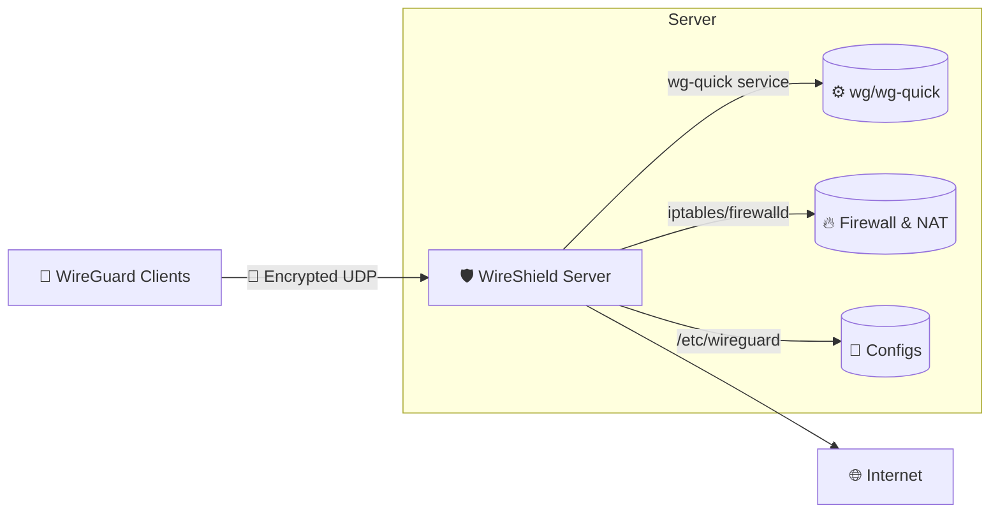
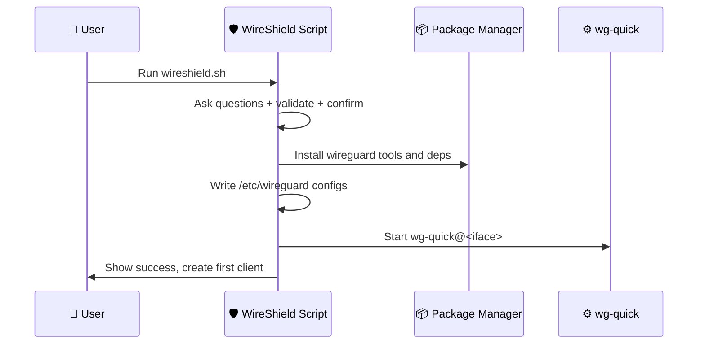

<div align="center">
<!-- dashboard assets removed -->
<h1>WireShield</h1>

[](https://www.gnu.org/licenses/gpl-3.0)
[](https://www.gnu.org/software/bash/)
[](https://www.wireguard.com/)
[](https://www.kernel.org/)
[](https://github.com/siyamsarker/WireShield)

**Secure, modern WireGuard VPN manager — CLI only**

*No curl pipe | No opaque installer | Just git clone & run*

[Quick Start](#-quick-start-clone--run) • [Features](#-overview) • [Documentation](#-table-of-contents)

---

</div>

## ✨ Overview

WireShield is a **single-file bash tool** that installs and manages a [WireGuard](https://www.wireguard.com/) VPN server in minutes. Set up a secure tunnel so clients can route traffic through your server (full-tunnel or split-tunnel), with automatic firewalling and IPv4/IPv6 support.

### 🚀 Highlights

- ⚡ **One-command install** with interactive prompts and final confirmation summary
- 🔧 **Kernel-aware**: built-in WireGuard on Linux 5.6+, module install on older kernels
- 🌐 **Dual-stack networking** (IPv4 and IPv6)
- 🔒 **Hardened defaults** and tight file permissions
- 📱 **Interactive client management** (add/list/revoke/expire), status, restart, backup
- ⏰ **Client expiration**: Set optional expiration dates for temporary access
- 🤖 **Automatic removal** of expired clients via cron
- 📲 **QR codes** for mobile onboarding
- 🔐 **2FA Authentication**: Google Authenticator (TOTP) for every connection — secure web UI, encrypted secrets, audit logs


## 📑 Table of contents

- [✨ Overview](#-overview)
- [🖥️ Supported platforms](#️-supported-platforms)
- [🚀 Quick start](#-quick-start-clone--run)
- [📦 Project structure](#-project-structure)
- [📖 Usage](#-usage)
- [⏰ Client expiration](#-client-expiration)
- [🔐 Two-Factor Authentication (2FA)](#-two-factor-authentication-2fa)
- [🏗️ Architecture](#️-architecture)
- [⚙️ Configuration details](#️-configuration-details)
- [🔐 Security considerations](#-security-considerations)
- [🔧 Troubleshooting](#-troubleshooting)
- [🗑️ Uninstall](#️-uninstall)
- [❓ FAQ](#-faq)
- [🤝 Contributing](#-contributing)
- [📄 License](#-license)
- [🙏 Acknowledgements](#-acknowledgements)

## 🖥️ Supported platforms

> **Linux servers only** (systemd-managed services).

WireShield supports these distributions out of the box:

| Distribution | Minimum Version | Notes |
|---|---|---|
| 🐧 AlmaLinux | ≥ 8 | Full support |
| 🏔️ Alpine Linux | Latest | Full support |
| 🎯 Arch Linux | Latest | Full support |
| 🌊 CentOS Stream | ≥ 8 | Full support |
| 🍥 Debian | ≥ 10 (Buster) | Backports for Debian 10 |
| 🎩 Fedora | ≥ 32 | Full support |
| 🔴 Oracle Linux | Latest | Full support |
| ⛰️ Rocky Linux | ≥ 8 | Full support |
| 🟠 Ubuntu | ≥ 18.04 (Bionic) | Full support |

## 🚀 Quick start (clone & run)

### 📋 Prerequisites

- ✅ **Linux server** with systemd (Ubuntu 18.04+, Debian 10+, Fedora 32+, CentOS Stream 8+, etc.)
- ✅ **Root access** (via `sudo` or direct root login)
- ✅ **Internet connection** for package installation
- ✅ **Public IP or domain** (for VPN server endpoint)
- ✅ **UDP port** open in firewall/security group (random port chosen during install)

### 🔧 Installation

```bash
# Clone the repository
git clone https://github.com/siyamsarker/WireShield.git
cd WireShield

# Run the installer (requires root)
sudo ./wireshield.sh
```

**What happens during installation:**

1. **System check** — Validates OS, kernel version, and virtualization environment
2. **Interactive configuration** — Answer prompts or accept defaults:
   * Public IP / hostname
   * Network interface
   * WireGuard interface name (default: wg0)
   * Server IPv4/IPv6 ranges
   * UDP port (random secure port suggested)
   * DNS resolvers for clients
   * Allowed IPs (0.0.0.0/0,::/0 for full tunnel)
3. **Confirmation summary** — Review all settings before proceeding
4. **Automatic installation:**
   * ✅ Install WireGuard tools & dependencies
   * ✅ Generate server keys (private, public, preshared)
   * ✅ Configure firewall rules (iptables/firewalld) automatically
   * ✅ Enable IP forwarding via sysctl
   * ✅ Set strict file permissions (0600) on all configs
   * ✅ Start WireGuard service (wg-quick@wg0)
   * ✅ Create your first client config with QR code
   * ✅ Setup automatic client expiration (cron job)
5. **Dashboard removed** — This repository now ships CLI-only. All management is via the interactive menu in `wireshield.sh`.

**Done!** 🎉 Your WireGuard server is running.

> ⚠️ **Important**: The installation script handles all permissions automatically. No manual configuration required.

### 🔁 Update later

```bash
cd /path/to/WireShield
git pull --rebase
sudo ./wireshield.sh   # access menu
```

## 📦 Project structure (CLI-only)

```
WireShield/
├─ 📜 wireshield.sh                      # Primary Bash manager (setup + client ops)
├─ 📄 LICENSE
└─ 📄 README.md
```

### 📝 Notes

- **Shell scripts**: Single entrypoint is `wireshield.sh` (run with sudo)
- **No web dashboard**: All Go/web components were removed; management is via CLI


## 📖 Usage

After initial setup, rerun the script anytime to open the **interactive menu**:

```bash
sudo ./wireshield.sh
```

### 📋 Menu options (CLI)

```text
╔═══════════════════════════════════════════════════════════════════════════╗
║                        WireShield Management                              ║
╠═══════════════════════════════════════════════════════════════════════════╣
║  1) 👤 Add a new client         │ Create a client config (+ QR)           ║
║  2) 📋 List clients              │ Show all clients with details          ║
║  3) 📲 Show QR for a client      │ Display scannable QR for mobile        ║
║  4) ❌ Revoke existing client    │ Remove peer and its config             ║
║  5) 🗓️  Check expired clients    │ Remove clients past expiration         ║
║  6) 📊 Show server status        │ wg show (peers, handshakes, etc.)      ║
║  7) 🔄 Restart WireGuard         │ Restart wg-quick@<iface>               ║
║  8) 💾 Backup configuration      │ Archive configs (safe copy)            ║
║  9) 🗑️  Uninstall WireGuard      │ Clean removal of WireGuard setup       ║
║ 10) 🚪 Exit                      │ Quit the manager                       ║
╚═══════════════════════════════════════════════════════════════════════════╝
```

### 💡 Notes

- If `whiptail` is present, you'll get a **dialog-based UI**; otherwise, a clean CLI menu
- Client files saved as `<name>.conf` in user's home directory
- **Client Expiration**: Set an expiration date (in days) when creating; expired clients auto-removed daily at 00:00
- "List clients" displays expiration dates
- Uninstall performs single confirmation and removes server config + client `.conf` files under `/root` and `/home`

## ⏰ Client expiration

WireShield supports **automatic client expiration** for temporary access scenarios (contractors, guests, trial periods).

### 🛠️ How it works

When creating a new client, you'll be prompted:

```
Client expiration (optional)
Leave empty for no expiration, or enter number of days until expiration
Expires in (days): 30
```

- ✅ Enter a number (e.g., `7`, `30`, `90`) for the client to expire after that many days
- ✅ Leave empty or press Enter to create a client with **no expiration**
- ✅ The expiration date is automatically calculated and stored in the server configuration

### 🤖 Automatic cleanup

- **🕐 Daily at 00:00**: WireShield installs a cron job that checks and removes expired clients automatically
- **🔍 Manual check**: Use menu option 5 ("Check expired clients") any time to scan and remove expired clients immediately
- **📝 Logging**: Expired client removals are logged to syslog

### 📋 Viewing expiration dates

Use menu option 2 ("List clients") to see all clients with their expiration dates:

```
Current clients:
   1) alice
   2) bob (expires: 2025-12-01)
   3) contractor-temp (expires: 2025-11-10)
```

Clients without expiration dates are shown without additional information.

### 🔧 Technical details

<details>
<summary><b>Click to expand</b></summary>

- Expiration dates stored in server config as: `### Client name | Expires: YYYY-MM-DD`
- Cross-platform compatible (supports both Linux GNU date and macOS BSD date)
- Expired clients removed completely: peer entry, configuration files, and all references
- Backward compatible with existing clients

</details>

## 🔐 Two-Factor Authentication (2FA)

WireShield includes **built-in Google Authenticator (TOTP) support** for secure pre-connection authentication.

### 🎯 How 2FA works

1. **User creates a VPN client** via `wireshield.sh`
   - 2FA is automatically enabled for new clients
   
2. **On first VPN connection**:
   - User attempts to connect with WireGuard
   - Firewall redirects to secure 2FA web UI
   
3. **User sets up authenticator**:
   - Scans QR code with Google Authenticator (or compatible app)
   - Optionally saves backup secret code
   
4. **User verifies and connects**:
   - Enters 6-digit code from their phone
   - Session token created (valid 24 hours)
   - VPN access granted
   
5. **On reconnect after session expires**:
   - User must re-verify with a new 6-digit code
   - New session token issued

### � SSL/TLS Configuration

During installation, you'll be asked to configure SSL/TLS certificates for the 2FA web UI:

**Three options available:**

1. **Let's Encrypt** (Recommended for production)
   - ✅ Trusted certificates for domain names
   - ✅ Auto-renewal (systemd timer runs daily)
   - ✅ Works on any Linux distribution
   - ⚠️ Requires valid domain name and public DNS

2. **Self-signed** (For IP addresses or internal networks)
   - ✅ Works with IP addresses (no DNS required)
   - ✅ Works with any hostname
   - ⚠️ Requires manual renewal after 1 year
   - ⚠️ Browser will show certificate warnings (normal for self-signed)

3. **None** (Development/localhost only)
   - ✅ Simplest option
   - ⚠️ Not recommended for production
   - ⚠️ Only works on localhost

**Installation example:**

```bash
sudo ./wireshield.sh

# You'll see prompts like:
# ✓ Configure SSL/TLS for 2FA service? (y/n): y
# ✓ Choose SSL certificate type:
#   1) Let's Encrypt (Domain name, auto-renewal)
#   2) Self-signed (IP address, manual renewal)
# ✓ Enter choice (1 or 2): 1
# ✓ Enter domain for 2FA (e.g., vpn.example.com): vpn.example.com
# ✓ [Auto-setup with certbot, creates renewal timer]

# After completion:
# ✓ WireGuard installed
# ✓ 2FA service installed (Python + FastAPI)
# ✓ SSL certificates configured
# ✓ First client created with 2FA enabled
```

### 🚀 Getting started

The 2FA service is **automatically installed and started** when you run `wireshield.sh`. 

For detailed SSL configuration options, see [2fa-auth/SSL_CONFIGURATION.md](./2fa-auth/SSL_CONFIGURATION.md).

### 📱 Compatible authenticator apps

- ✅ Google Authenticator (iOS/Android) — **Recommended**
- ✅ Authy (iOS/Android) — Backup codes included
- ✅ Microsoft Authenticator (iOS/Android)
- ✅ LastPass Authenticator
- ✅ Any TOTP-compatible app (Bitwarden, 1Password, etc.)

### 🔧 Manual management

```bash
# Check 2FA service status
sudo systemctl status wireshield-2fa

# View 2FA service logs
sudo journalctl -u wireshield-2fa -f

# Enable 2FA for a specific client
sudo /etc/wireshield/2fa/2fa-helper.sh enable alice

# Disable 2FA for a client (not recommended)
sudo /etc/wireshield/2fa/2fa-helper.sh disable alice

# Check client 2FA status
sudo /etc/wireshield/2fa/2fa-helper.sh status alice

# View authentication audit log
sudo sqlite3 /etc/wireshield/2fa/auth.db \
  "SELECT * FROM audit_log ORDER BY timestamp DESC LIMIT 20;"
```

### 🔒 Security details

- **Secrets stored encrypted** in SQLite database at `/etc/wireshield/2fa/auth.db`
- **Sessions time-bound** (24-hour default, configurable)
- **HTTPS-only** with self-signed certificates (or Let's Encrypt in production)
- **Rate limiting ready** to prevent brute-force attacks
- **Audit logging** for all authentication attempts
- **Firewall integration** for per-user access control

### 📖 Full documentation

See [DEPLOYMENT_2FA.md](./DEPLOYMENT_2FA.md) for:
- Detailed installation instructions
- API endpoint documentation
- Troubleshooting guide
- Security hardening
- Performance tuning
- Monitoring and metrics

## 🏗️ Architecture



### 📊 Install flow (high level)



## ⚙️ Configuration details

### 📁 Files and paths

| Path | Purpose | Permissions |
|---|---|---|
| `/etc/wireguard/<interface>.conf` | Server configuration | `0600` |
| `/etc/wireguard/params` | Global installation parameters | `0600` |
| `$HOME/<client>.conf` | Client configuration files | `0600` |
| `/etc/sysctl.d/wg.conf` | Kernel forwarding settings | `0644` |

### 🔥 Firewall rules

- **firewalld**: Zones and rich rules for NAT/masquerade applied automatically
- **iptables**: INPUT/FORWARD/POSTROUTING rules for the selected UDP port and interface

### 🛣️ Client routing (AllowedIPs)

- **Full tunnel** (default): `0.0.0.0/0,::/0` — all traffic routed through VPN
- **Split tunnel**: Set narrower ranges (e.g., `10.0.0.0/8,192.168.0.0/16`) for office networks only

### 🌐 DNS

- Specify preferred DNS resolvers during install
- Clients inherit these DNS settings automatically

### 📏 MTU

- Default MTU works for most networks
- Set custom MTU in client configs if needed (comment provided in file)

## 🔐 Security considerations

> **🔒 Security-first design**

- ✅ **Root privileges required** by design (network stack, firewall, sysctl, `/etc/wireguard`)
- ✅ **Fresh key pairs** generated per client (public/private keys + pre-shared keys)
- ✅ **Strict file permissions** (configs at `0600`)
- ✅ **Minimal system changes** (only necessary interface, port, forwarding)

### 🚀 Production deployment checklist

Before deploying WireShield in production, ensure you've completed these steps:

#### 📋 Pre-deployment

- [ ] **Server hardening** — Follow your organization's security baseline
- [ ] **Firewall configuration** — Ensure chosen UDP port is open in cloud provider security groups
- [ ] **Backup strategy** — Plan for regular config backups (use menu option 8)
- [ ] **Monitoring** — Add service checks for `wg-quick@<iface>` and log volume
- [ ] **Documentation** — Document your chosen settings (port, IP ranges, DNS)

#### 🔒 Security hardening

- [ ] **SSH hardening** — Disable password auth, use key-based authentication only
- [ ] **Firewall rules** — Enable UFW/firewalld and allow only necessary ports
- [ ] **Automatic updates** — Enable unattended security updates for your OS

#### ✅ Post-installation verification

- [ ] **Service status** — `sudo systemctl status wg-quick@wg0` shows active
- [ ] **Connectivity test** — Connect from a test client and verify internet access
- [ ] **Peer handshake** — `sudo wg show` displays recent handshake times
- [ ] **DNS resolution** — Verify clients can resolve domains (test with `nslookup google.com`)
- [ ] **Client expiration** — Create test client with short expiry, verify auto-removal
- [ ] **Backup/restore** — Test backup creation and restoration process

#### 📊 Operational readiness

- [ ] **Monitoring alerts** — Set up alerts for service downtime
- [ ] **Log retention** — Configure syslog/journald retention policies
- [ ] **Client onboarding** — Document process for adding new users
- [ ] **Runbook** — Create operations guide for common tasks
- [ ] **Disaster recovery** — Test full server rebuild from backups

### 🔧 Automated permission handling

WireShield automatically configures all required permissions during installation:

- **File permissions**: All configs set to `0600` (owner read/write only)
- **Systemd services**: Automatically enabled and started
- **Firewall rules**: iptables/firewalld rules applied automatically
- **IP forwarding**: Kernel parameters configured via sysctl
- **Cron jobs**: Expiration check scheduled without manual intervention
**No manual permission configuration required.** The installation is fully automated.

### 🔄 Upgrade

From your cloned repository:

```bash
git pull --rebase
sudo ./wireshield.sh
```

The single entrypoint `wireshield.sh` handles initial setup, client management, and future re-runs. If you previously used the one-line curl installer, just clone the repo and continue managing with this script.

## 🗑️ Uninstall

WireShield provides a complete, automated uninstallation process that removes all components and configurations.

### 🔴 Complete removal

From the interactive menu, choose option **9) Uninstall WireGuard** or run:

```bash
sudo ./wireshield.sh
# Select option 9 from the menu
```

**What gets removed automatically:**

1. **WireGuard service** — Stops and disables wg-quick service
2. **WireGuard packages** — Removes wireguard-tools, qrencode, and related packages
3. **Server configuration** — Deletes `/etc/wireguard` directory completely
4. **Client configurations** — Removes all `*.conf` files from `/root` and `/home/*` directories
5. **Firewall rules** — Cleans up iptables/firewalld rules via PostDown hooks
6. **Kernel settings** — Removes `/etc/sysctl.d/wg.conf` (IP forwarding config)
7. **Cron jobs** — Removes automatic client expiration cron entry
8. **Helper scripts** — Deletes `/usr/local/bin/wireshield-check-expired`

### ⚠️ Important notes

- **Single confirmation required** — The script asks once, then performs complete cleanup
- **Automatic cleanup** — No manual intervention needed, all components removed
- **Backup reminder** — You'll be prompted to backup `/etc/wireguard` if needed
- **Client file cleanup** — All detected client `.conf` files are removed from user directories
- **Nginx optional** — You can choose to keep Nginx if used for other services

### 📦 Manual verification (optional)

After uninstall, verify complete removal:

```bash
# Check WireGuard service
sudo systemctl status wg-quick@wg0
# Should show: "Unit wg-quick@wg0.service could not be found"

# Check for remaining configs
sudo ls /etc/wireguard
# Should show: "ls: cannot access '/etc/wireguard': No such file or directory"

# Check for client files
find /root /home -name "*.conf" 2>/dev/null | grep -v ssh
# Should return empty or only non-WireGuard configs
```

> ✅ **Clean slate guaranteed** — The uninstall process ensures your server is returned to its pre-WireShield state.

## ❓ FAQ

<details>
<summary><b>Can I reuse a client name after revoking?</b></summary>

Yes. Revoking removes the peer and its `.conf` files, allowing name reuse.

</details>

<details>
<summary><b>Can I change the expiration date for an existing client?</b></summary>

Currently, you need to revoke the client and recreate it with a new expiration date. Direct expiration modification may be added in a future update.

</details>

<details>
<summary><b>What happens to expired clients?</b></summary>

They are automatically removed (peer configuration and all files) by a daily cron job at 00:00, or immediately when you run the manual expiration check (menu option 5).

</details>

<details>
<summary><b>Where are client configs saved?</b></summary>

In the invoking user's home (root or sudo user), typically `/root` or `/home/<user>`.

</details>

<details>
<summary><b>Do I need IPv6?</b></summary>

No. Dual-stack is supported. You can use IPv4 only if you prefer.

</details>

## 🤝 Contributing

We welcome contributions from the community! Whether you're reporting bugs, suggesting features, or submitting code, your help makes WireShield better.

### 🐛 Reporting bugs

If you encounter a bug or unexpected behavior:

1. Check the [Troubleshooting](#-troubleshooting) section first
2. Search existing [issues](https://github.com/siyamsarker/WireShield/issues) to see if it's already reported
3. If not, [open a new issue](https://github.com/siyamsarker/WireShield/issues/new) with:
   - Clear title and description
   - Steps to reproduce
   - Your OS/distro and kernel version (`uname -r`)
   - WireGuard version (`wg --version`)
   - Relevant logs or error messages

### 💡 Suggesting features

Have an idea? Open an issue with the `enhancement` label and describe:

- The problem or use case
- Your proposed solution
- Any alternatives you've considered

### 🔧 Submitting pull requests

1. **Fork the repository**
2. **Create a feature branch** (`git checkout -b feature/your-feature`)
3. **Make your changes:**
   - Keep bash best practices in mind (shellcheck is your friend)
   - Add comments for non-obvious logic
   - Test on at least one supported distro
4. **Commit with clear messages** (`git commit -m "feat: add X"` or `fix: resolve Y`)
5. **Push to your fork** and open a pull request
6. **Wait for review** and address any feedback

### 📋 Coding standards

- Use tabs for indentation (match existing style)
- Quote variables (`"${VAR}"`) to avoid word splitting
- Prefer `[[ ]]` over `[ ]` for conditionals
- Add function-level comments explaining purpose
- Keep functions focused and reusable

### 🧪 Testing

Before submitting, please test your changes:

- Run `bash -n wireshield.sh` to check syntax
- Test install/uninstall flow on a VM or container
- Verify client add/revoke operations work

Thank you for helping improve WireShield! 🙏

## 📄 License

Licensed under the [GNU GPL v3.0](LICENSE).

## 🙏 Acknowledgements

WireShield was inspired by the simplicity-first approach of WireGuard tooling and community best practices for secure VPN setups.

---

<div align="center">

Made with ❤️ by [Siyam Sarker](https://github.com/siyamsarker)

⭐ **Star this repo if you find it helpful!**

</div>
