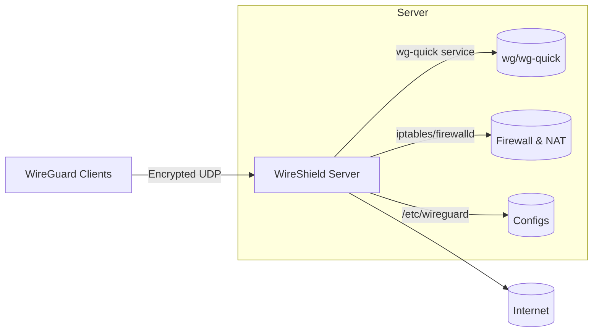
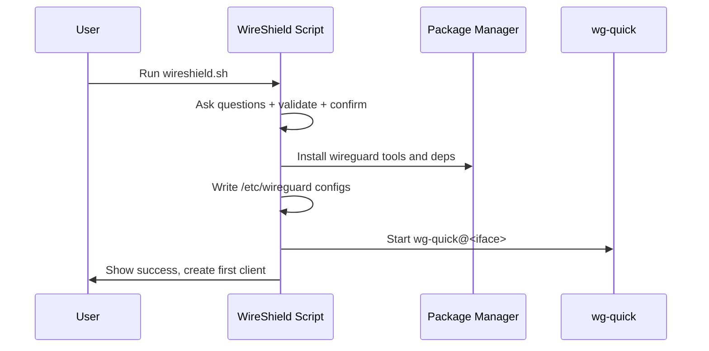

<div align="center">

# WireShield

[](https://opensource.org/licenses/MIT)
[](https://www.gnu.org/software/bash/)
[](https://www.wireguard.com/)

Secure, modern, one-command WireGuard VPN installer and manager for Linux.

<sub>Simple to use. Sensible defaults. Production-friendly.</sub>

</div>

## Overview

WireShield is a single-file bash tool that installs and manages a [WireGuard](https://www.wireguard.com/) VPN server in minutes. It sets up a secure tunnel so clients can route traffic through your server (full-tunnel or split-tunnel), with automatic firewalling and IPv4/IPv6 support.

Highlights:

- One-command install with interactive prompts and a final confirmation summary
- Kernel-aware: built-in WireGuard on Linux 5.6+, module install on older kernels
- Dual-stack networking (IPv4 and IPv6)
- Hardened defaults and tight file permissions
- Interactive client management (add/list/revoke/expire), status, restart, backup
- **Client expiration**: Set optional expiration dates for temporary access
- Automatic removal of expired clients
- Optional QR codes for mobile onboarding; optional TUI (whiptail) when installed


## Table of contents

- [Overview](#overview)
- [Supported platforms](#supported-platforms)
- [Quick start](#quick-start)
- [Usage](#usage)
- [Client expiration](#client-expiration)
- [Architecture](#architecture)
- [Configuration details](#configuration-details)
- [Security considerations](#security-considerations)
- [Troubleshooting](#troubleshooting)
- [Web Dashboard (optional)](#web-dashboard-optional)
- [Uninstall](#uninstall)
- [FAQ](#faq)
- [Contributing](#contributing)
- [License](#license)
- [Acknowledgements](#acknowledgements)

## Supported platforms

WireShield supports these Linux distributions out of the box:

- AlmaLinux ≥ 8
- Alpine Linux
- Arch Linux
- CentOS Stream ≥ 8
- Debian ≥ 10
- Fedora ≥ 32
- Oracle Linux
- Rocky Linux ≥ 8
- Ubuntu ≥ 18.04
## Quick start (no clone needed)

Download and run the script as root (or with sudo):

```bash
wget https://raw.githubusercontent.com/siyamsarker/WireShield/master/wireshield.sh -O wireshield.sh
chmod +x wireshield.sh
sudo ./wireshield.sh
```

You’ll be asked a few questions (address/hostname, public NIC, wg interface, IPs, port, DNS, AllowedIPs). A summary is shown at the end—confirm to proceed. WireShield will install WireGuard, configure the server, enable forwarding, set firewall rules, and create your first client.

Web Dashboard (GUI)

- The installer is a single flow that covers both the CLI and the GUI. During setup, you'll be prompted to enable the dashboard (default: Yes).
- All dependencies are installed automatically; if Go isn't available, the installer will fetch and install it to build the dashboard.
- You can also install or reinstall the dashboard later (no clone required) with:

```bash
curl -fsSL https://raw.githubusercontent.com/siyamsarker/WireShield/master/scripts/install-dashboard.sh | sudo bash
```

The dashboard binds to 127.0.0.1:51821 by default; expose it via your HTTPS reverse proxy.

### Alternative: clone the repo (for contributors)

If you prefer working from a full checkout (or want to build from source):

```bash
git clone https://github.com/siyamsarker/WireShield.git
cd WireShield
# Install CLI
sudo ./wireshield.sh
# Install dashboard (from repo)
sudo ./scripts/install-dashboard.sh
```

## Usage

After installation, rerun the script anytime to open the interactive menu:

```
 1) Add a new client
 2) List clients
 3) Show QR for a client
 4) Revoke existing client
 5) Check expired clients
 6) Show server status
 7) Restart WireGuard
 8) Backup configuration
 9) Uninstall WireGuard
10) Exit
```

Notes:

- If `whiptail` is present, you'll get a dialog-based UI; otherwise, a clean CLI menu.
- Client files are saved as `<name>.conf` in the user's home directory.
- **Client Expiration**: You can optionally set an expiration date (in days) when creating a client. Expired clients are removed automatically every day at 00:00 (midnight) by a cron job installed by WireShield.
- The "List clients" option displays expiration dates for clients that have them.
- Uninstall performs a single confirmation and removes server config and detected client `.conf` files under `/root` and `/home`.

## Client expiration

WireShield supports automatic client expiration for temporary access scenarios (contractors, guests, trial periods, etc.).

### How it works

When creating a new client, you'll be prompted:

```
Client expiration (optional)
Leave empty for no expiration, or enter number of days until expiration
Expires in (days): 30
```

- Enter a number (e.g., `7`, `30`, `90`) for the client to expire after that many days
- Leave empty or press Enter to create a client with no expiration
- The expiration date is automatically calculated and stored in the server configuration

### Automatic cleanup

- **Daily at 00:00**: WireShield installs a cron job that checks and removes expired clients automatically at midnight
- **Manual check**: Use menu option 5 ("Check expired clients") any time to scan and remove expired clients immediately
- When expired clients are found, they are removed from the server and all configuration files are deleted; actions are logged to syslog

### Viewing expiration dates

Use menu option 2 ("List clients") to see all clients with their expiration dates:

```
Current clients:
   1) alice
   2) bob (expires: 2025-12-01)
   3) contractor-temp (expires: 2025-11-10)
```

Clients without expiration dates are shown without any additional information.

### Technical details

- Expiration dates are stored in the server config as: `### Client name | Expires: YYYY-MM-DD`
- Cross-platform compatible (supports both Linux GNU date and macOS BSD date)
- Expired clients are removed completely: peer entry, configuration files, and all references
- Works seamlessly with existing clients (backward compatible)

## Architecture



Install flow (high level):



## Configuration details

- Files and paths
  - Server config: `/etc/wireguard/<interface>.conf` (0600)
  - Global params: `/etc/wireguard/params`
  - Client configs: user home (e.g., `/root`, `/home/<user>`)
  - Sysctl settings: `/etc/sysctl.d/wg.conf`

- Firewall rules
  - firewalld: zones and rich rules for NAT/masquerade are applied automatically
  - iptables: INPUT/FORWARD/POSTROUTING rules for the selected UDP port and interface

- Client routing (AllowedIPs)
  - Default is `0.0.0.0/0,::/0` (full tunnel). Set a narrower range for split tunnel.

- DNS
  - Specify preferred DNS resolvers during install; clients inherit these.

- MTU
  - You can set a custom MTU in client configs if needed (comment provided in file).

## Security considerations

- Runs with root privileges by design (network stack, firewall, sysctl, and `/etc/wireguard`).
- Generates fresh key pairs and pre-shared keys per client.
- Restricts config permissions to 0600.
- Minimizes system changes to the necessary interface, port, and forwarding settings.

## Troubleshooting

- Port and connectivity
  - Ensure the chosen UDP port is open in provider firewalls/security groups and any local firewall.
  - UFW example:
    ```bash
    sudo ufw allow <your_port>/udp
    sudo ufw reload
    ```

- Service status and peers
  - Check service status:
    ```bash
    sudo systemctl status wg-quick@wg0
    ```
  - Show live peers/handshakes:
    ```bash
    sudo wg show
    ```

- Kernel and module
  - WireGuard is built into Linux 5.6+. On older kernels the module is installed.
  - Verify:
    ```bash
    uname -r
    wg --version
    ```
  - If you see “Cannot find device wg0”, reboot the server first.

- No internet on client
  - Reboot the server after kernel or package updates.
  - Confirm forwarding:
    ```bash
    sysctl net.ipv4.ip_forward net.ipv6.conf.all.forwarding
    ```
  - Try setting a lower MTU (e.g., 1420) in the client config if you suspect fragmentation.

- QR code not shown
  - Ensure `qrencode` is installed (the installer attempts this automatically when available).

- Client expiration not working
  - A cron job runs daily at 00:00 to remove expired clients. Verify it's installed:
    ```bash
    crontab -l | grep wireshield-check-expired || echo "no cron entry"
    ```
  - Check logs to see removals:
    ```bash
    sudo grep wireshield /var/log/syslog || journalctl -t wireshield
    ```
  - You can also manually check using menu option 5 ("Check expired clients").
  - Ensure your system date/time is correct (`date`).

<details>
<summary>More tips</summary>

- Endpoint hostname vs IP
  - You can use a hostname for the public address; ensure DNS resolves correctly from clients.

- Double NAT scenarios
  - If your server sits behind NAT, ensure UDP port forwarding is configured on the upstream router.

- Split tunnel examples
  - For office subnets only, set AllowedIPs to e.g. `10.0.0.0/8,192.168.0.0/16` instead of default `0.0.0.0/0,::/0`.

</details>

## Web Dashboard (optional)

WireShield includes an optional, lightweight web dashboard that lets you do everything the CLI menu can do: sign in, list/add/revoke clients, download configs, and run an expiration cleanup.

Key points:

- Secure-by-default: binds to `127.0.0.1:51821`; put behind your TLS reverse proxy (Caddy, Nginx, Traefik)
- Simple auth: local admin users with bcrypt-hashed passwords and signed session cookies
- Modern UI: minimal, responsive HTML with Pico.css + HTMX (no heavy SPA)
- Minimal footprint: single Go binary, HTML templates embedded

Features at a glance:

- Clients list with actions (download config, view QR, revoke)
- Dedicated QR page with PNG download and one-click “Copy config”
- Flash messages after actions (revoke, restart, expire check)
- CSRF protection, secure cookies, strict security headers (CSP, XFO, XCTO)
- Login rate limiting per client IP
- Health endpoint at `/health` returns `200 ok` for monitoring

Why Go? Similar projects often choose:

- wg-easy (Node.js + Docker + Vue) — popular, container-first but heavier runtime
- wireguard-ui (Go + templates) — single binary, fast, low memory
- Others (React/Next/Flask/Django) — capable, but often add more moving parts

We follow the proven, ops-friendly "single static binary" approach for reliability and ease of deployment.

### Install the dashboard

During install, if the Go toolchain is detected, you’ll be prompted to install the dashboard automatically. You can also install it later:

```bash
sudo ./scripts/install-dashboard.sh
```

The installer will:
- Ensure dependencies (including Go if missing)
- Build and install `/usr/local/bin/wireshield-dashboard`
- Create `/etc/wireshield/dashboard-config.json` with a random admin password
- Install and start `wireshield-dashboard.service`

Notes:
- If your distro Go package is too old, the installer fetches a suitable tarball from go.dev and installs it under `/usr/local/go` for the build.

Then access it via your reverse proxy at `https://your-domain/` or locally `http://127.0.0.1:51821`.

Sample Caddyfile (TLS via Let’s Encrypt):

```caddyfile
your.domain.com {
  reverse_proxy 127.0.0.1:51821
}
```

Nginx example (snippet):

```nginx
location / {
    proxy_pass http://127.0.0.1:51821;
    proxy_set_header Host $host;
    proxy_set_header X-Real-IP $remote_addr;
    proxy_set_header X-Forwarded-For $proxy_add_x_forwarded_for;
    proxy_set_header X-Forwarded-Proto $scheme;
}
```

Notes:
- Change the default admin password right after first login.
- Keep the service bound to localhost and terminate TLS at the proxy.
- The dashboard shells out to the script’s programmatic API (ws_* functions) and requires root.

### Manage admin password

Use the Settings page in the dashboard to change the current admin’s password. This updates the bcrypt hash in `dashboard-config.json`. A minimum length of 8 characters is enforced, and session cookies expire after 24 hours by default.

Non-interactive initialization/reset can also be done from the CLI (overwrites existing admin list):

```bash
sudo /usr/local/bin/wireshield-dashboard \
  -init-admin <username> \
  -init-admin-pass <password> \
  -config /etc/wireshield/dashboard-config.json
sudo systemctl restart wireshield-dashboard
```

### QR codes for mobile onboarding

From the Clients page, click “QR” next to a client to view a QR code encoding the full WireGuard client configuration. Scan it in the WireGuard mobile app to import.

### Configuration (dashboard)

Dashboard configuration lives at `/etc/wireshield/dashboard-config.json`:

```json
{
  "listen": "127.0.0.1:51821",
  "session_key": "<random>",
  "admins": [
    {"username": "admin", "password_hash": "<bcrypt>"}
  ]
}
```

- `listen`: Keep as 127.0.0.1 and expose via an HTTPS reverse proxy
- `session_key`: Random string used for signing cookies
- `admins`: Local admin accounts; passwords are bcrypt-hashed

To initialize or reset admins non-interactively:

```bash
sudo /usr/local/bin/wireshield-dashboard \
  -init-admin <username> \
  -init-admin-pass <password> \
  -config /etc/wireshield/dashboard-config.json
sudo systemctl restart wireshield-dashboard
```

### Development (dashboard)

Run the dashboard locally (without systemd):

```bash
cd dashboard
go build -o wireshield-dashboard ./cmd/wireshield-dashboard
WIRE_SHIELD_SCRIPT=/path/to/wireshield.sh \
  ./wireshield-dashboard -config ./dev-config.json
```

Tips:
- Point `WIRE_SHIELD_SCRIPT` to your `wireshield.sh` if it’s not in the default location.
- Create a minimal `dev-config.json` next to the binary if needed; the server will generate defaults on first run.

## Uninstall

From the menu, choose "Uninstall WireGuard". The script will stop the service, remove packages and `/etc/wireguard`, reload sysctl, remove detected client `.conf` files from `/root` and `/home`, and clean up the automatic expiration cron job and helper script.

## FAQ

- Can I reuse a client name after revoking?
  - Yes. Revoking removes the peer and its `.conf` files, allowing name reuse.

- Can I change the expiration date for an existing client?
  - Currently, you need to revoke the client and recreate it with a new expiration date. Direct expiration modification may be added in a future update.

- What happens to expired clients?
  - They are automatically removed (peer configuration and all files) by a daily cron job at 00:00, or immediately when you run the manual expiration check (menu option 5).

- Where are client configs saved?
  - In the invoking user's home (root or sudo user), typically `/root` or `/home/<user>`.

- Do I need IPv6?
  - No. Dual-stack is supported. You can use IPv4 only if you prefer.

## Contributing

We welcome contributions from the community! Whether you're reporting bugs, suggesting features, or submitting code, your help makes WireShield better.

### Reporting bugs

If you encounter a bug or unexpected behavior:

1. Check the [Troubleshooting](#troubleshooting) section first.
2. Search existing [issues](https://github.com/siyamsarker/WireShield/issues) to see if it's already reported.
3. If not, [open a new issue](https://github.com/siyamsarker/WireShield/issues/new) with:
   - Clear title and description
   - Steps to reproduce
   - Your OS/distro and kernel version (`uname -r`)
   - WireGuard version (`wg --version`)
   - Relevant logs or error messages

### Suggesting features

Have an idea? Open an issue with the `enhancement` label and describe:

- The problem or use case
- Your proposed solution
- Any alternatives you've considered

### Submitting pull requests

1. Fork the repository
2. Create a feature branch (`git checkout -b feature/your-feature`)
3. Make your changes:
   - Keep bash best practices in mind (shellcheck is your friend)
   - Add comments for non-obvious logic
   - Test on at least one supported distro
4. Commit with clear messages (`git commit -m "feat: add X"` or `fix: resolve Y`)
5. Push to your fork and open a pull request
6. Wait for review and address any feedback

### Coding standards

- Use tabs for indentation (match existing style)
- Quote variables (`"${VAR}"`) to avoid word splitting
- Prefer `[[ ]]` over `[ ]` for conditionals
- Add function-level comments explaining purpose
- Keep functions focused and reusable

### Testing

Before submitting, please test your changes:

- Run `bash -n wireshield.sh` to check syntax
- Test install/uninstall flow on a VM or container
- Verify client add/revoke operations work

Thank you for helping improve WireShield!

## License

Licensed under the [MIT License](LICENSE).

## Acknowledgements

WireShield was inspired by the simplicity-first approach of WireGuard tooling and community best practices for secure VPN setups.


