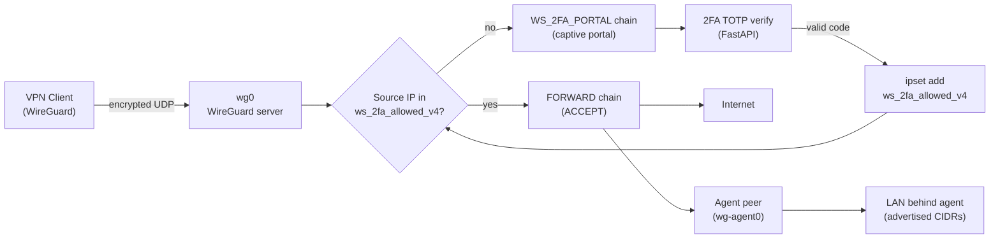
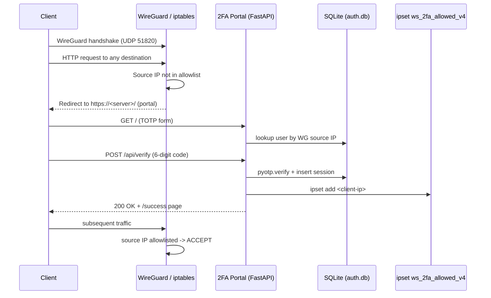
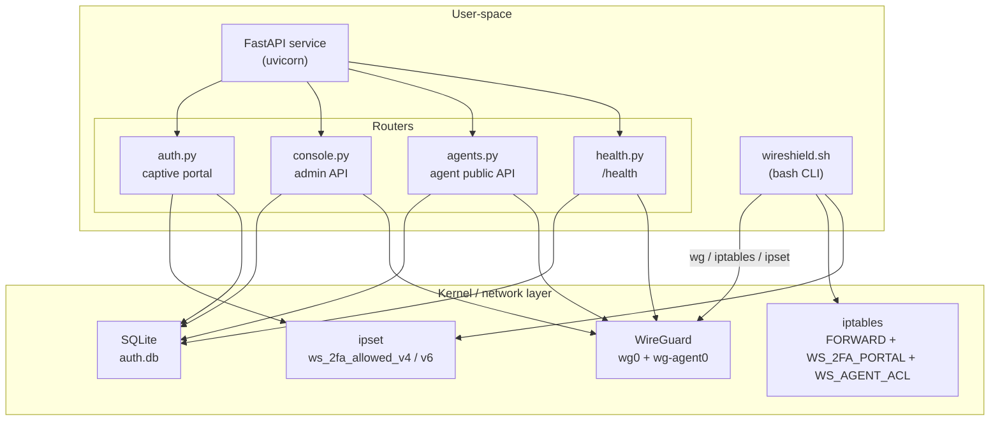
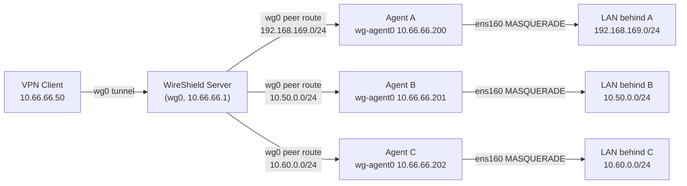

<div align="center">


# WireShield

**Zero-trust WireGuard VPN with pre-connection two-factor authentication**

[](#)
[](https://www.gnu.org/licenses/gpl-3.0)
[](https://www.wireguard.com/)
[](https://www.python.org/)
[](https://fastapi.tiangolo.com/)
[](https://go.dev/)

WireShield deploys a WireGuard VPN with mandatory TOTP-based two-factor authentication at the connection layer. Every client must verify through a captive portal before any traffic is allowed through the tunnel. A built-in agent system lets remote Linux servers register as WireGuard peers — authenticated VPN clients can then route traffic to private LANs on those servers with no extra client-side configuration.

</div>

---

## Why WireShield

- **Zero-trust 2FA at the connection layer.** A successful WireGuard handshake is not enough — every client is firewall-quarantined to the captive portal until a TOTP code is verified, then allowlisted via `ipset` for the rest of the session.
- **Extend the VPN to remote LANs through the agent fleet.** Outbound-only Go daemons enroll over a single-use token, advertise their LAN CIDRs, and authenticated VPN users can reach those subnets immediately — no client-side routes, no re-enrollment when CIDRs change.
- **One interactive bash installer for the whole stack.** `sudo ./wireshield.sh` provisions WireGuard, the 2FA FastAPI service, firewall, SSL, and cross-compiled agent binaries on nine major Linux distros in roughly five minutes.

---

<details>
<summary>Table of contents</summary>

- [Why WireShield](#why-wireshield)
- [How It Works](#how-it-works)
- [Features](#features)
- [Quick Start](#quick-start)
- [System Requirements](#system-requirements)
- [Installation](#installation)
- [Configuration](#configuration)
- [SSL / TLS](#ssl--tls)
- [Usage](#usage)
- [Architecture](#architecture)
- [Agents](#agents)
- [Operations and Troubleshooting](#operations-and-troubleshooting)
- [Uninstall](#uninstall)
- [Development](#development)
- [Contributing](#contributing)
- [License](#license)

</details>

---

## How It Works

An authenticated session is the product of three independent gates: a WireGuard handshake, a TOTP verification at the captive portal, and ongoing handshake freshness. The diagram below traces a single packet from a client device through every gate to the public internet (or to a LAN behind an agent).


```mermaid
flowchart LR
    Client["VPN Client<br/>(WireGuard)"] -->|encrypted UDP| WG["wg0<br/>WireGuard server"]
    WG --> Check{"Source IP in<br/>ws_2fa_allowed_v4?"}
    Check -- no --> Portal["WS_2FA_PORTAL chain<br/>(captive portal)"]
    Portal --> TOTP["2FA TOTP verify<br/>(FastAPI)"]
    TOTP -->|valid code| IPSet["ipset add<br/>ws_2fa_allowed_v4"]
    IPSet --> Check
    Check -- yes --> FWD["FORWARD chain<br/>(ACCEPT)"]
    FWD --> Internet["Internet"]
    FWD --> Agent["Agent peer<br/>(wg-agent0)"]
    Agent --> LAN["LAN behind agent<br/>(advertised CIDRs)"]
```

### VPN + 2FA Flow

Every VPN client must pass a TOTP challenge through the captive portal before any traffic is forwarded through the tunnel.


```mermaid
sequenceDiagram
    participant Client
    participant WireGuard as WireGuard / iptables
    participant Portal as 2FA Portal (FastAPI)
    participant DB as SQLite (auth.db)
    participant IPSet as ipset ws_2fa_allowed_v4

    Client->>WireGuard: WireGuard handshake (UDP 51820)
    Client->>WireGuard: HTTP request to any destination
    WireGuard->>WireGuard: Source IP not in allowlist
    WireGuard-->>Client: Redirect to https://<server>/ (portal)
    Client->>Portal: GET / (TOTP form)
    Portal->>DB: lookup user by WG source IP
    Client->>Portal: POST /api/verify (6-digit code)
    Portal->>DB: pyotp.verify + insert session
    Portal->>IPSet: ipset add <client-ip>
    Portal-->>Client: 200 OK + /success page
    Client->>WireGuard: subsequent traffic
    WireGuard->>WireGuard: source IP allowlisted -> ACCEPT
```

```text
┌──────────────────┐
│  Client Device   │
│  (WireGuard)     │
└────────┬─────────┘
         │  Connect VPN tunnel
         ▼
┌──────────────────────────────────────────────────┐
│                 WireGuard Server                 │
│  ┌────────────────────────────────────────────┐  │
│  │       iptables / ipset Firewall            │  │
│  │                                            │  │
│  │   Client IP in allowlist?                  │  │
│  │     ├── YES ──► ACCEPT (full access)       │  │
│  │     └── NO  ──► WS_2FA_PORTAL chain        │  │
│  │                   ├── Allow DNS (port 53)  │  │
│  │                   ├── Allow portal (80/443)│  │
│  │                   └── DROP everything else │  │
│  └────────────────────────────────────────────┘  │
│                      │                           │
│                      ▼                           │
│  ┌────────────────────────────────────────────┐  │
│  │       2FA Captive Portal (HTTPS)           │  │
│  │                                            │  │
│  │   1. User opens browser                    │  │
│  │   2. Redirected to portal                  │  │
│  │   3. Enter TOTP code from authenticator    │  │
│  │   4. Client IP added to ipset allowlist    │  │
│  │   5. Full internet + agent LAN access      │  │
│  └────────────────────────────────────────────┘  │
└──────────────────────────────────────────────────┘
```

### Agent Network Extension

Agents are Go daemons deployed on remote Linux servers. Each agent dials outbound into the WireShield VPN as a WireGuard peer and advertises its local LAN CIDRs. The server adds those CIDRs to the agent's `AllowedIPs`, so any authenticated VPN client can reach them without any client-side changes.

```text
┌──────────────────────┐       ┌────────────────────────────────────────────┐
│     VPN Client       │       │           WireShield Server                │
│     (WireGuard)      │◄─────►│                  (wg0)                     │
└──────────────────────┘  WG   │                                            │
                        tunnel │  wg0 peer table:                           │
                               │  ┌──────────────────────────────────────┐  │
                               │  │ VPN Client   AllowedIPs 10.8.0.2/32  │  │
                               │  │ Agent        AllowedIPs 10.8.0.200/32│  │
                               │  │              + 10.50.0.0/24          │  │
                               │  │              (advertised LAN CIDRs)  │  │
                               │  └──────────────────────────────────────┘  │
                               └──────────────────────┬─────────────────────┘
                                                      │
                                          outbound WireGuard tunnel
                                                 (wg-agent0)
                                                      │
                                                      ▼
                               ┌────────────────────────────────────────────┐
                               │          Remote Linux Server               │
                               │                                            │
                               │   wireshield-agent                         │
                               │   · dials outbound, no open inbound ports  │
                               │   · heartbeat to server every 30 s         │
                               │   · polls revocation every 60 s            │
                               │   · token-enrolled, managed by systemd     │
                               │                                            │
                               │   Private LAN: 10.50.0.0/24                │
                               └────────────────────────────────────────────┘
```

Traffic from any authenticated VPN client destined for `10.50.0.0/24` is forwarded through the server's WireGuard peer for the agent, which NATs it into the remote LAN. No routes, no config changes, no restarts on the client side — the server applies `wg syncconf` live.

### Session Rules

| Rule                 | Behavior                                                       |
| :------------------- | :------------------------------------------------------------- |
| **Absolute timeout** | Sessions expire after 24 hours regardless of activity          |
| **Disconnect grace** | If the VPN disconnects, the session survives for 1 hour        |
| **Reconnect < 1h**   | Instant access, no re-authentication required                  |
| **Reconnect > 1h**   | Session revoked, 2FA required again                            |
| **Strict revocation** | Expired sessions immediately block all traffic                |

---

## Features

| Category               | Capability                                  | Details                                                                                                                              |
| :--------------------- | :------------------------------------------ | :----------------------------------------------------------------------------------------------------------------------------------- |
| Security               | Pre-connection 2FA                          | TOTP (RFC 6238 compatible) verified at a captive portal before any traffic is forwarded                                              |
| Security               | TLS / SSL                                   | Let's Encrypt auto-renewal or self-signed certificates                                                                               |
| Security               | Rate limiting                               | 30 requests per 60 seconds per IP/endpoint                                                                                           |
| Security               | ipset-based firewall                        | O(1) allowlist lookups for IPv4 and IPv6                                                                                             |
| Security               | Session-gated portal pages                  | `/success`, `/console` and user APIs reject callers without a non-expired 2FA session                                                |
| Security               | WireGuard handshake monitoring              | 3-second polling for real-time session tracking                                                                                      |
| Security               | Audit logging                               | Comprehensive log of all authentication events                                                                                       |
| Admin Console          | Dashboard                                   | Real-time statistics, charts, and active session monitoring                                                                          |
| Admin Console          | User management                             | Pagination, search, in-browser Create / Revoke actions, per-user Download `.conf` — no SSH required                                  |
| Admin Console          | Per-client access control                   | Admin console permission, expiry dates                                                                                               |
| Admin Console          | Traffic activity                            | Logs with DNS resolution and protocol analysis                                                                                       |
| Admin Console          | Bandwidth insights                          | Per-client daily upload/download tracking                                                                                            |
| Admin Console          | Audit trail                                 | All security events (2FA setup, verification, failures)                                                                              |
| Operational Features   | One-command installation                    | Interactive CLI wizard                                                                                                               |
| Operational Features   | Nine Linux distributions supported          | Ubuntu, Debian, Fedora, CentOS, Alma, Rocky, Oracle, Arch, Alpine                                                                    |
| Operational Features   | Systemd integration                         | Hardened service configuration                                                                                                       |
| Operational Features   | Client management via CLI                   | Add, list, revoke, reset 2FA                                                                                                         |
| Operational Features   | Configurable log retention                  | Automatic cleanup                                                                                                                    |
| Operational Features   | Activity logging                            | iptables-based traffic capture with DNS enrichment                                                                                   |
| Operational Features   | Self-healing watchdog                       | Detects WireGuard interface flaps, re-asserts portal firewall rules, auto-restarts the DNS/TLS sniffer                               |
| Operational Features   | Diagnostic `/health` endpoint               | Exposes WireGuard state, iptables rules, database stats, watchdog history, and agent fleet stats for monitoring                      |
| Operational Features   | Agent fleet                                 | Deploy WireShield agent daemons on remote Linux servers — reverse-connection, outbound-only, token-enrolled                          |

---

## Quick Start

> [!IMPORTANT]
> WireShield requires Linux with systemd, root privileges, an open UDP port for WireGuard, and reachable TCP `80`/`443` for the captive portal. See [System Requirements](#system-requirements) for the full list.

Install with a single command:

```bash
git clone https://github.com/siyamsarker/WireShield.git
cd WireShield
sudo ./wireshield.sh
```

A successful install ends with a "Subsystem status" panel that lists each component (WireGuard interface, 2FA portal + admin console, agent binaries) with a check or warning mark, followed by a "Next steps" panel pointing at the captive portal URL and the admin console. The interactive installer handles everything along the way: WireGuard setup, firewall rules, SSL certificates, 2FA service, and your first client configuration. Takes about 5 minutes.

> [!TIP]
> Next steps: [Step 2 — Verify the installation](#step-2-verify-the-installation) and [Step 3 — Add your first VPN client](#step-3-add-your-first-vpn-client).

---

## System Requirements

### Server

- **OS:** Linux with systemd (kernel 5.6+ for built-in WireGuard, or compatible module)
- **Architecture:** x86_64, ARM64
- **RAM:** 512 MB minimum
- **Access:** Root privileges, public IP or domain, open UDP port

### Supported Distributions

| Distribution    | Minimum Version | Notes                                            |
| :-------------- | :-------------- | :----------------------------------------------- |
| Ubuntu          | 18.04 (Bionic)  | Tested through 24.04 LTS and 26.04, incl. EC2 cloud kernels |
| Debian          | 10 (Buster)     | 11/12 use the standard apt path                  |
| Fedora          | 32              |                                                  |
| CentOS Stream   | 8               | v9 supported (EPEL auto-installed for ipset)     |
| AlmaLinux       | 8               | v9 supported (EPEL auto-installed for ipset)     |
| Rocky Linux     | 8               | v9 supported (EPEL auto-installed for ipset)     |
| Oracle Linux    | 8               | v9 supported (uses AppStream + EPEL)             |
| Arch Linux      | Rolling         |                                                  |
| Alpine Linux    | 3.14            |                                                  |

> The installer auto-loads the required kernel modules (`wireguard`, `ip6table_nat`, `nf_conntrack`) and persists them across reboots via `/etc/modules-load.d/wireshield.conf` (or `/etc/modules` on Alpine). On cloud kernels (AWS/GCP/Azure/Oracle images) where `wireguard.ko` ships in a separate package, it automatically installs the matching `linux-modules-extra-<kernel>` package — or the flavor meta-package when the exact name isn't indexed — and, if no kernel module can be provisioned at all, falls back to the userspace `wireguard-go` implementation so the install still completes (at reduced throughput).

### Client

- Any WireGuard client (Windows, macOS, Linux, iOS, Android)
- A TOTP authenticator app (Google Authenticator, Authy, Microsoft Authenticator, 1Password, Bitwarden)
- A web browser for 2FA verification

---

## Installation

### Prerequisites

Before running the installer, ensure the following are in place:

| Requirement          | Details                                                                                                  |
| :------------------- | :------------------------------------------------------------------------------------------------------- |
| **Operating system** | Linux with systemd — see [Supported Distributions](#supported-distributions)                             |
| **Privileges**       | Root or `sudo` access during installation                                                                |
| **Inbound ports**    | UDP `51820` (WireGuard, configurable); TCP `80` and `443` (captive portal)                               |
| **Public address**   | A static public IP or a domain name pointing to the server                                               |
| **Domain name**      | Required only for Let's Encrypt; a bare IP works fine with self-signed TLS                               |
| **Packages**         | `git` and `curl` — pre-installed on most distributions                                                   |

### Step 1. Clone and run the installer

```bash
git clone https://github.com/siyamsarker/WireShield.git
cd WireShield
chmod +x wireshield.sh
sudo ./wireshield.sh
```

Select **Install WireShield** from the main menu. The interactive wizard walks through each component in order:

| Section        | What it configures                                                              |
| :------------- | :------------------------------------------------------------------------------ |
| **Network**    | Public IP/hostname (auto-detected), public interface                            |
| **WireGuard**  | Interface name, server IPv4/IPv6 subnet, UDP listen port                        |
| **Client DNS** | Primary and secondary resolvers pushed to clients (default: Cloudflare)         |
| **Routing**    | `AllowedIPs` controlling what traffic routes through the tunnel                 |
| **SSL/TLS**    | Let's Encrypt (certbot), self-signed certificate, or disabled                   |

A review summary is displayed before anything is written to disk. All prompts have sensible defaults — press Enter to accept them.

The installer sets up WireGuard, configures iptables/ipset firewall rules, generates SSL certificates, deploys the 2FA FastAPI service under systemd, and writes all configuration to `/etc/wireshield/`.

### Step 2. Verify the installation

```bash
sudo wg show                                         # WireGuard interface + peers
sudo systemctl status wireshield.service             # 2FA portal service running?
sudo journalctl -u wireshield.service -f             # Live service logs
curl -sk https://localhost/health | jq .status       # Expect "ok"
```

The `/health` endpoint returns a JSON snapshot of every subsystem. If `status` is `"degraded"`, check the individual fields (`database`, `wireguard`, `iptables_portal`) to identify which component needs attention.

### Step 3. Add your first VPN client

```bash
sudo ./wireshield.sh   # Select option 1 — Create Client
```

Enter a client ID when prompted (e.g. `alice`). The wizard generates a WireGuard `.conf` file and a QR code at:

```text
/etc/wireshield/clients/alice.conf
```

Transfer it to the client device via `scp`, email, or by scanning the QR code printed directly in the terminal.

### Step 4. Enable admin console access

By default no client has admin console access. Grant it to a specific client:

```bash
sudo ./wireshield.sh   # Select option 12 — Console Access
```

Enter the `client_id` (e.g. `alice`) when prompted. Once granted, that client can reach `https://<server-ip>/console` — but only while holding an active 2FA session (connect VPN → complete captive portal → browse to `/console`).

### Step 5. Connect the VPN client

1. Import the `.conf` file into any WireGuard app (Windows, macOS, Linux, iOS, Android) or scan the QR code.
2. Toggle the VPN tunnel on.
3. Open a browser — you will be redirected to the captive portal automatically.
4. **First connection:** the portal shows a QR code; scan it with your authenticator app (Google Authenticator, Authy, etc.), then enter the 6-digit code.
5. **Subsequent connections:** enter the current 6-digit TOTP code directly.
6. Access granted. Session stays valid for 24 hours.

---

## Configuration

Edit `/etc/wireshield/2fa/config.env` and restart the service:

```bash
sudo systemctl restart wireshield.service
```

### Key Settings

| Variable                              | Default                              | Description                                                                                                                                                                                                                  |
| :------------------------------------ | :----------------------------------- | :--------------------------------------------------------------------------------------------------------------------------------------------------------------------------------------------------------------------------- |
| `WS_2FA_SESSION_TIMEOUT`              | `1440`                               | Session lifetime in minutes (24h)                                                                                                                                                                                            |
| `WS_2FA_SESSION_IDLE_TIMEOUT`         | `3600`                               | Handshake freshness threshold in seconds (1h)                                                                                                                                                                                |
| `WS_2FA_DISCONNECT_GRACE_SECONDS`     | `3600`                               | Grace period after disconnect in seconds (1h)                                                                                                                                                                                |
| `WS_2FA_RATE_LIMIT_MAX_REQUESTS`      | `30`                                 | Max requests per rate limit window                                                                                                                                                                                           |
| `WS_2FA_RATE_LIMIT_WINDOW`            | `60`                                 | Rate limit window in seconds                                                                                                                                                                                                 |
| `WS_2FA_ACTIVITY_LOG_RETENTION_DAYS`  | `30`                                 | Days to retain activity logs                                                                                                                                                                                                 |
| `WS_2FA_LOG_LEVEL`                    | `INFO`                               | Logging verbosity                                                                                                                                                                                                            |
| `WS_2FA_SSL_TYPE`                     | set by installer (`letsencrypt`, `self-signed`, or `none`) | The installer writes this to `/etc/wireshield/2fa/config.env` based on your SSL choice. Python falls back to `self-signed` only if the variable is unset. Valid values: `letsencrypt`, `self-signed`, `disabled`. |
| `WS_2FA_DOMAIN`                       |                                      | Domain name for Let's Encrypt                                                                                                                                                                                                |
| `WS_AGENT_TOKEN_TTL_SECONDS`          | `3600`                               | Enrollment token lifetime (1 hour)                                                                                                                                                                                           |
| `WS_AGENT_IP_START`                   | `200`                                | First WG IPv4 octet reserved for agents (inside the server subnet)                                                                                                                                                           |
| `WS_AGENT_IP_END`                     | `254`                                | Last WG IPv4 octet reserved for agents                                                                                                                                                                                       |
| `WS_AGENT_HEARTBEAT_RETENTION_HOURS`  | `48`                                 | Hours of `agent_heartbeats` rows to retain before housekeeping prunes them                                                                                                                                                   |
| `WS_AGENT_OFFLINE_AFTER_SECONDS`      | `90`                                 | Seconds without a heartbeat before an agent is reported as `online=false` in `/health`                                                                                                                                       |
| `WS_AGENT_BINARY_DIR`                 | `/etc/wireshield/agent-binaries`     | Server-side directory holding pre-built Go-agent binaries + SHA-256 sidecars, populated by `make -C agent install`                                                                                                           |
| `WS_HEARTBEAT_REQUIRE_SIG`            | `0`                                  | When `1`, the heartbeat endpoint rejects bearer-only requests and requires the `X-Agent-Sig` HMAC headers. Flip on once every deployed agent has been upgraded to a binary that signs heartbeats.                            |
| `WS_CSRF_DISABLE`                     | `0`                                  | Emergency rollback for the console CSRF check. Leave at `0` in production.                                                                                                                                                   |

### Agent-side environment

| Variable                              | Default                  | Description                                                                                                                                                                                                                                              |
| :------------------------------------ | :----------------------- | :--------------------------------------------------------------------------------------------------------------------------------------------------------------------------------------------------------------------------------------------------------|
| `WIRESHIELD_TLS_INSECURE`             | `0`                      | `1` to skip TLS verification on the agent → server channel. Set on the systemd unit (`Environment=WIRESHIELD_TLS_INSECURE=1`) instead of persisting in `config.json`; the agent installer sets this automatically when invoked with `AGENT_INSECURE_TLS=1`. |
| `WIRESHIELD_REQUIRE_SIGNED_UPDATES`   | `0`                      | `1` to refuse any auto-update from an unsigned manifest, even on agents built without an embedded release public key.                                                                                                                                    |
| `WIRESHIELD_AGENT_LOG_LEVEL`          | `info`                   | `debug`, `info`, `warn`, or `error`.                                                                                                                                                                                                                     |
| `WIRESHIELD_AGENT_DIR`                | `/etc/wireshield-agent`  | On-disk state directory (config, private key, heartbeat secret).                                                                                                                                                                                         |

### Tuning Examples

**Session and portal:**

```ini
# Extend session lifetime to 7 days
WS_2FA_SESSION_TIMEOUT=10080

# More lenient disconnect detection (2 hours grace)
WS_2FA_SESSION_IDLE_TIMEOUT=7200

# Tighter disconnect detection (10 seconds grace)
WS_2FA_DISCONNECT_GRACE_SECONDS=10

# Keep activity logs for 90 days instead of 30
WS_2FA_ACTIVITY_LOG_RETENTION_DAYS=90
```

**Agent fleet:**

```ini
# Shorten enrollment token TTL to 15 minutes for tighter security
WS_AGENT_TOKEN_TTL_SECONDS=900

# Mark agents offline faster — useful if heartbeat interval is tuned down
WS_AGENT_OFFLINE_AFTER_SECONDS=45

# Reserve a different IP range for agents (e.g. .150–.199 within the server subnet)
WS_AGENT_IP_START=150
WS_AGENT_IP_END=199

# Keep 7 days of heartbeat history for the metrics sparklines
WS_AGENT_HEARTBEAT_RETENTION_HOURS=168

# Serve agent binaries from a custom directory
WS_AGENT_BINARY_DIR=/opt/wireshield/agent-binaries
```

---

## SSL / TLS

The installer configures TLS during setup based on your choice (Let's Encrypt, self-signed, or disabled). Use the commands below for ongoing certificate operations.

### Let's Encrypt

Auto-renewal is configured via systemd timer during installation.

```bash
sudo systemctl status wireshield-2fa-renew.timer  # Check timer
sudo certbot renew --dry-run                       # Test renewal
sudo certbot certificates                          # View cert details
```

### Self-Signed

> [!WARNING]
> Self-signed certificates leave clients vulnerable to MITM until the certificate is explicitly added to the client's trust store. Until then, an active network attacker can intercept the captive portal handshake and replay credentials. Pin or import the cert on every client device, or switch to Let's Encrypt for production deployments.

```bash
# Check expiry
sudo openssl x509 -in /etc/wireshield/2fa/cert.pem -noout -dates

# Regenerate (365 days)
sudo openssl req -x509 -newkey rsa:4096 \
  -keyout /etc/wireshield/2fa/key.pem \
  -out /etc/wireshield/2fa/cert.pem \
  -days 365 -nodes -subj "/CN=<your-ip>"
sudo systemctl restart wireshield.service
```

---

## Usage

### Client Management

All client operations are available through the interactive menu:

```bash
sudo ./wireshield.sh
```

The menu is organized into categories: **Client Management**, **Server Operations**, **Security & Logging**, and **System**. Enter a number to select or `q` to exit.

|   # | Option              | Description                                              |
| --: | :------------------ | :------------------------------------------------------- |
|   1 | Create Client       | Generate WireGuard config and QR code                    |
|   2 | List Clients        | Show all registered VPN clients                          |
|   3 | Display Client QR   | Render config as terminal QR code                        |
|   4 | Revoke Client       | Remove client, sessions, and firewall entries            |
|   5 | Clean Up Expired    | Remove expired clients automatically                     |
|   6 | View Status         | WireGuard runtime info                                   |
|   7 | Restart VPN         | Restart the WireGuard service                            |
|   8 | Backup Config       | Archive /etc/wireguard                                   |
|   9 | Audit Logs          | View 2FA authentication events                           |
|  10 | Remove Client 2FA   | Reset 2FA for lost authenticator devices                 |
|  11 | Activity Logs       | Enable/disable logging, set retention, view traffic      |
|  12 | Console Access      | Toggle admin console access per client                   |
|  13 | Uninstall           | Remove WireShield completely                             |

### For VPN Users

1. Import the `.conf` file into your WireGuard client and connect
2. Your browser opens the captive portal automatically
3. First time: scan the QR code with your authenticator app, then enter the 6-digit code
4. Returning: enter the current 6-digit code from your authenticator app
5. Access granted. Session valid for 24 hours

### Using the Admin Console

Access the web console at `https://<server-ip>/console`. Two conditions must both hold:

1. The client must have `console_access = 1` in the users table.
2. The client must have an **active (non-expired) 2FA session**. Expired sessions are denied access even if `console_access = 1`, so an idle admin has to re-verify TOTP at the captive portal before they can reach the console again.

The console provides:

- **Overview** with active users, sessions, bandwidth, and event charts
- **Bandwidth Insights** with per-client upload/download data
- **User Management** with status, IPs, access control — plus in-browser **Create User**, per-row **Download Config** (`.conf` file) and **Revoke** buttons
- **Audit Trail** for security events
- **Traffic Activity** with connection logs, DNS resolution, and filtering

---

## Architecture

WireShield is a thin orchestration layer on top of WireGuard. The bash CLI shells out to kernel-level primitives (`wg`, `iptables`, `ipset`), the FastAPI service brokers user-facing auth and bookkeeping in SQLite, and the Go agents extend the WireGuard data plane out to remote LANs.

### System Components


```mermaid
flowchart TB
    subgraph User["User-space"]
        CLI["wireshield.sh<br/>(bash CLI)"]
        FastAPI["FastAPI service<br/>(uvicorn)"]
        subgraph Routers["Routers"]
            R1["auth.py<br/>captive portal"]
            R2["console.py<br/>admin API"]
            R3["agents.py<br/>agent public API"]
            R4["health.py<br/>/health"]
        end
        FastAPI --> R1
        FastAPI --> R2
        FastAPI --> R3
        FastAPI --> R4
    end
    subgraph Kernel["Kernel / network layer"]
        WG["WireGuard<br/>wg0 + wg-agent0"]
        IPT["iptables<br/>FORWARD + WS_2FA_PORTAL + WS_AGENT_ACL"]
        IPSET["ipset<br/>ws_2fa_allowed_v4 / v6"]
        DB["SQLite<br/>auth.db"]
    end

    CLI -->|wg / iptables / ipset| WG
    CLI --> IPT
    CLI --> IPSET
    R1 --> IPSET
    R1 --> DB
    R2 --> DB
    R2 --> WG
    R3 --> DB
    R3 --> WG
    R4 --> DB
    R4 --> WG
```

| Component        | Technology                       | Purpose                                                                                       |
| :--------------- | :------------------------------- | :-------------------------------------------------------------------------------------------- |
| Installer & CLI  | Bash                             | Server setup, client management, firewall config, agent binary build                          |
| 2FA Service      | Python, FastAPI                  | Captive portal, TOTP, session management, admin console API                                   |
| Admin Console    | Vanilla JavaScript, Chart.js     | Web UI for users, sessions, agents, bandwidth, activity logs                                  |
| Database         | SQLite                           | Users, sessions, audit logs, activity, bandwidth, agents, heartbeats, ACL grants              |
| Firewall         | iptables, ipset                  | Zero-trust access control + per-user agent allowlist enforcement                              |
| VPN              | WireGuard                        | Encrypted tunnel for both VPN clients and agent peers                                         |
| DNS Sniffer      | scapy                            | IP-to-domain resolution for activity logs                                                     |
| Monitors         | Background threads               | Handshake tracking, ipset sync, HTTP redirect, agent ACL sync, watchdog                       |
| Agent daemon     | Go (static binary)               | Remote-LAN gateway: outbound WireGuard peer + heartbeat + self-update                         |

### Background Services

| Monitor                       | Interval     | Function                                                                                                                                                                          |
| :---------------------------- | :----------- | :-------------------------------------------------------------------------------------------------------------------------------------------------------------------------------- |
| WireGuard session monitor     | 3s           | Polls handshakes, tracks bandwidth, revokes stale sessions                                                                                                                        |
| ipset sync daemon             | 60s          | Removes clients without active sessions from firewall                                                                                                                             |
| HTTP redirector               | Continuous   | Redirects port 80 to HTTPS captive portal                                                                                                                                         |
| Activity log ingestion        | 5s           | Parses kernel logs into queryable database records                                                                                                                                |
| Log retention cleanup         | Daily        | Purges activity logs older than retention period                                                                                                                                  |
| Interface watchdog            | 30s          | Tracks WireGuard interface state; logs flaps; re-inserts missing `INPUT ACCEPT` rules for ports 80/443                                                                            |
| DNS + TLS SNI sniffer         | Continuous   | Auto-recovering sniffer; waits for `wg0` to come back up before resuming after interface drops                                                                                    |
| Agent housekeeping            | 1h           | Purges expired/used enrollment tokens and prunes `agent_heartbeats` older than the retention window                                                                               |
| Agent ACL iptables sync       | 30s          | Rebuilds the `WS_AGENT_ACL` iptables chain to match the current per-user allowlist for all restricted agents; also triggered immediately on every grant/revoke                    |
| WireGuard peer reconcile      | 60s          | Re-adds enrolled agent peers missing from the running `wg0` and rewrites stale `AllowedIPs`, healing drift from a failed sync or an out-of-band interface restart                 |
| Unresolved-IP resolver        | 60s          | Reverse-resolves activity-log destination IPs that are missing from the DNS cache, enriching the Traffic Activity view                                                            |

### File Layout

```text
/etc/wireguard/
├── wg0.conf                  # WireGuard server configuration (VPN clients + agent peers)
└── params                    # Installation parameters

/etc/wireshield/2fa/
├── config.env                # Service configuration (WS_2FA_* and WS_AGENT_* variables)
├── auth.db                   # SQLite database (users, sessions, agents, heartbeats, audit)
├── cert.pem                  # SSL certificate
├── key.pem                   # SSL private key
├── app/                      # FastAPI application (routers, core, templates module)
├── static/                   # CSS, JS, fonts
├── run.py                    # ASGI entrypoint
├── requirements.txt          # Python dependencies (installed into .venv on install)
└── .venv/                    # Python virtual environment

/etc/wireshield/clients/       # Generated VPN client .conf files (mode 0700/0600)
└── <client>.conf             # Written by CLI (ws_add_client) and console "Create User"

/etc/wireshield/agent-binaries/  # Pre-built Go agent binaries served by the API
├── wireshield-agent_linux_amd64        # Static binary for x86_64
├── wireshield-agent_linux_amd64.sha256
├── wireshield-agent_linux_arm64        # Static binary for ARM64
├── wireshield-agent_linux_arm64.sha256
└── version.json                        # Optional auto-update manifest (operator-authored, not produced by `make install`)

/etc/systemd/system/
├── wireshield.service             # 2FA + admin console service unit
├── wireshield-ipsets.service      # Oneshot: pre-creates the 2FA ipsets before wg-quick starts
├── wg-quick@wg0.service.d/
│   └── wireshield-ipsets.conf     # Drop-in ordering wg-quick after the ipset unit
├── wireshield-2fa-renew.service   # Let's Encrypt renewal worker (if applicable)
└── wireshield-2fa-renew.timer     # Let's Encrypt renewal timer (if applicable)
```

### API Endpoints

**Authentication:**

| Method   | Path                       | Description                                                                                            |
| :------- | :------------------------- | :----------------------------------------------------------------------------------------------------- |
| `GET`    | `/`                        | 2FA setup or verification page                                                                         |
| `GET`    | `/success`                 | Post-verification success page                                                                         |
| `POST`   | `/api/setup-start`         | Generate TOTP secret and QR code                                                                       |
| `POST`   | `/api/setup-verify`        | Verify initial TOTP code during setup                                                                  |
| `POST`   | `/api/verify`              | Verify TOTP code for existing users                                                                    |
| `POST`   | `/api/validate-session`    | Check session token validity                                                                           |
| `GET`    | `/health`                  | Diagnostic snapshot: database, WireGuard interface, iptables rules, watchdog state, agent ACL chain    |

**Admin Console:**

| Method   | Path                                                  | Description                                                                                                  |
| :------- | :---------------------------------------------------- | :----------------------------------------------------------------------------------------------------------- |
| `GET`    | `/console`                                            | Admin dashboard                                                                                              |
| `GET`    | `/api/console/users`                                  | User list with pagination and search                                                                         |
| `POST`   | `/api/console/users`                                  | Create a new WireGuard client (JSON body: `client_id`, `expiry_days?`)                                       |
| `GET`    | `/api/console/users/{client}/config`                  | Download the client's `.conf` file                                                                           |
| `GET`    | `/api/console/users/{client}/qrcode`                  | Return a base64 PNG QR code of the client config                                                             |
| `DELETE` | `/api/console/users/{client}`                         | Revoke a client (remove peer, delete config, clear sessions)                                                 |
| `GET`    | `/api/console/audit-logs`                             | Audit events with filtering                                                                                  |
| `GET`    | `/api/console/activity-logs`                          | Traffic logs with DNS resolution                                                                             |
| `GET`    | `/api/console/bandwidth-usage`                        | Per-client bandwidth data                                                                                    |
| `GET`    | `/api/console/dashboard-stats`                        | Dashboard metrics                                                                                            |
| `GET`    | `/api/console/dashboard-charts`                       | Chart visualization data                                                                                     |
| `POST`   | `/api/console/agents`                                 | Register a new agent; returns a single-use enrollment token + install command                                |
| `GET`    | `/api/console/agents`                                 | List agents (add `?include_revoked=true` to include revoked rows)                                            |
| `GET`    | `/api/console/agents/{id}`                            | Agent detail (preshared key is redacted)                                                                     |
| `PATCH`  | `/api/console/agents/{id}`                            | Update advertised CIDRs or description                                                                       |
| `DELETE` | `/api/console/agents/{id}`                            | Revoke an agent (removes its WG peer + marks DB row as revoked)                                              |
| `POST`   | `/api/console/agents/{id}/rotate-token`               | Reissue an enrollment token for a `pending` agent                                                            |
| `GET`    | `/api/console/agents/{id}/metrics`                    | Time-bucketed RX/TX deltas + uptime % from heartbeats                                                        |
| `GET`    | `/api/console/agents/{id}/access`                     | Read `is_restricted` flag + per-user allowlist                                                               |
| `POST`   | `/api/console/agents/{id}/access`                     | Grant a user (body: `{client_id}`) — triggers immediate iptables sync                                        |
| `DELETE` | `/api/console/agents/{id}/access/{client_id}`         | Remove a user from the allowlist                                                                             |

**Agent Public API** (called by the agent daemon, not by humans):

| Method   | Path                                | Description                                                                                |
| :------- | :---------------------------------- | :----------------------------------------------------------------------------------------- |
| `POST`   | `/api/agents/enroll`                | Exchange a single-use token for a WG peer config (public/keyless endpoint, rate-limited)   |
| `POST`   | `/api/agents/heartbeat`             | Periodic liveness + bandwidth report (auth: bearer token + optional HMAC signature)        |
| `GET`    | `/api/agents/revocation-check`      | Agent polls this to self-disable when revoked (auth: bearer token + optional HMAC signature) |
| `GET`    | `/api/agents/install`               | **Legacy** Bash installer (kept for backward compatibility)                                |
| `GET`    | `/api/agents/install-go`            | Bash bootstrap that downloads the Go binary                                                |
| `GET`    | `/api/agents/binary/{arch}`         | Pre-built agent binary (`linux-amd64`, `linux-arm64`)                                      |
| `GET`    | `/api/agents/binary/{arch}.sha256`  | Sidecar SHA-256 checksum for integrity verification                                        |
| `GET`    | `/api/agents/unit`                  | systemd unit file (`wireshield-agent.service`)                                             |
| `GET`    | `/api/agents/version`               | Version manifest used by `--auto-update` agents                                            |

---

## Agents

Agents are statically-linked Go daemons deployed on remote Linux servers. They connect **outbound** to the WireShield VPN and register themselves as a special WireGuard peer whose `AllowedIPs` include the LAN CIDRs they advertise. Any VPN client can then route traffic for those CIDRs through the agent, with the VPN server enforcing the same zero-trust policies. Agents are enrolled with single-use tokens (1-hour TTL, SHA-256 hashed at rest); thereafter every heartbeat and revocation check is authenticated by a per-agent bearer secret issued at enrollment, with an optional HMAC signature that blocks captured-token replay.

> [!TIP]
> The happy path: register an agent in the console, run the install one-liner on the remote host, verify the heartbeat, route VPN clients through the agent's advertised CIDRs.


```mermaid
flowchart LR
    Client["VPN Client<br/>10.66.66.50"] -->|wg0 tunnel| Server["WireShield Server<br/>(wg0, 10.66.66.1)"]
    Server -->|wg0 peer route<br/>192.168.169.0/24| Agent1["Agent A<br/>wg-agent0 10.66.66.200"]
    Server -->|wg0 peer route<br/>10.50.0.0/24| Agent2["Agent B<br/>wg-agent0 10.66.66.201"]
    Server -->|wg0 peer route<br/>10.60.0.0/24| Agent3["Agent C<br/>wg-agent0 10.66.66.202"]
    Agent1 -->|ens160 MASQUERADE| LAN1["LAN behind A<br/>192.168.169.0/24"]
    Agent2 -->|ens160 MASQUERADE| LAN2["LAN behind B<br/>10.50.0.0/24"]
    Agent3 -->|ens160 MASQUERADE| LAN3["LAN behind C<br/>10.60.0.0/24"]
```

**How traffic flows: User → WireShield → Agent → Local LAN**

```text
VPN Client (user laptop)          WireShield Server             Agent Host              Local LAN
192.168.1.x / 10.66.66.50         47.x.x.x (public)            10.66.66.200            192.168.169.0/24
        │                                │                            │                       │
        │  1. WireGuard tunnel           │                            │                       │
        │◄──────────────────────────────►│                            │                       │
        │                                │                            │                       │
        │  2. curl http://192.168.169.5  │                            │                       │
        │──────────────────────────────► │                            │                       │
        │                                │ wg0 peer AllowedIPs for    │                       │
        │                                │ agent includes             │                       │
        │                                │ 192.168.169.0/24 →         │                       │
        │                                │ kernel routes packet to    │                       │
        │                                │ agent peer (10.66.66.200)  │                       │
        │                                │──────────────────────────► │                       │
        │                                │  3. WireGuard tunnel       │                       │
        │                                │     (agent's wg-agent0)    │ ip_forward=1          │
        │                                │                            │ FORWARD ACCEPT        │
        │                                │                            │ MASQUERADE            │
        │                                │                            │──────────────────────►│
        │                                │                            │  4. Forwarded packet  │
        │                                │                            │     src: agent LAN IP │
        │◄─────────────────────────────────────────────────────────────────────────────────────
        │                   5. Response travels the same path in reverse
```

**What each component does:**

| Component             | Role                                                                                                                                                                                                            |
| :-------------------- | :-------------------------------------------------------------------------------------------------------------------------------------------------------------------------------------------------------------- |
| **WireShield server** | Terminates the client tunnel. Routes packets destined for an agent's advertised CIDRs to that agent's WireGuard peer (via kernel routing — the agent's peer entry has `AllowedIPs = <wg-ip>/32, <LAN-CIDRs>`).  |
| **Agent (wg-agent0)** | Maintains a persistent outbound WireGuard tunnel to the server. Accepts packets from the VPN subnet, forwards them to the LAN via `ip_forward=1`, and masquerades the source with iptables POSTROUTING.         |
| **VPN client**        | Sends all traffic through the WireGuard tunnel (`AllowedIPs = 0.0.0.0/0`). No special routes or configuration needed — the server handles all routing decisions.                                                |

**iptables rules on the agent host** (written to `/etc/wireguard/wg-agent0.conf` as `PostUp`/`PreDown`):

```ini
PostUp = sysctl -w net.ipv4.ip_forward=1
PostUp = iptables -A FORWARD -i wg-agent0 -j ACCEPT
PostUp = iptables -A FORWARD -o wg-agent0 -j ACCEPT
PostUp = iptables -t nat -A POSTROUTING -s 10.66.66.0/24 -o eth0 -j MASQUERADE
PreDown = iptables -D FORWARD -i wg-agent0 -j ACCEPT
PreDown = iptables -D FORWARD -o wg-agent0 -j ACCEPT
PreDown = iptables -t nat -D POSTROUTING -s 10.66.66.0/24 -o eth0 -j MASQUERADE
```

**CIDR auto-sync:** When an admin updates an agent's advertised CIDRs via the console, the change is applied server-side immediately (wg0.conf peer `AllowedIPs` updated + `wg syncconf`). On the next heartbeat (within 30 seconds), the agent daemon receives the new CIDRs, calls `iptables` to apply them live, and rewrites `/etc/wireguard/wg-agent0.conf` so they persist after a reboot — no manual intervention required.

**Advertised LAN CIDRs are required** when registering an agent. They cannot be left empty because without them the server has no CIDRs to route to the agent, the agent writes no iptables rules, and LAN access is silently broken.

### Step 1. Publish agent binaries on the VPN server (one-time setup)

**Done automatically by `sudo ./wireshield.sh`.** The installer:

1. Detects whether Go 1.25+ is already on the server and uses it if so
2. Otherwise downloads the official Go 1.25 tarball from go.dev (or `apk add go` on Alpine)
3. Cross-compiles `wireshield-agent` for `linux-amd64` and `linux-arm64`
4. Publishes the binaries + SHA-256 sidecars to `/etc/wireshield/agent-binaries/`
5. Marks `/etc/wireshield/.go-installed-by-wireshield` so the uninstaller knows to clean Go up

The whole step adds ~30 seconds to a fresh install. **Skip to Step 2.**

To rebuild manually (e.g. after pulling new agent code):

```bash
cd WireShield
make -C agent dist
sudo make -C agent install AGENT_BINARY_DIR=/etc/wireshield/agent-binaries
```

To skip the agent build entirely during install (useful for headless environments without internet access to go.dev):

```bash
WS_SKIP_AGENT_BUILD=1 sudo ./wireshield.sh
```

This populates `/etc/wireshield/agent-binaries/` with:

```text
wireshield-agent_linux_amd64
wireshield-agent_linux_amd64.sha256
wireshield-agent_linux_arm64
wireshield-agent_linux_arm64.sha256
version.json
```

> [!NOTE]
> No Go available? Use the [legacy Bash installer](#advanced) instead — it requires no build step and works on any enrolled agent.

### Step 2. Register the agent in the admin console

1. Open `https://<server-ip>/console` in your browser and complete 2FA.
2. Click **Agents** in the left sidebar.
3. Click **Register Agent**.
4. Fill in the form:
   - **Name** — a short, unique identifier (e.g. `branch-office-01`)
   - **Description** — optional free text
   - **Advertised CIDRs** — the LAN subnets reachable through this agent, one per line (e.g. `10.50.0.0/24`)
5. Click **Register**.

The console displays a one-time install command. **Copy it immediately** — it will not be shown again. If it expires (1-hour TTL), use the **Reissue token** button on the pending agent row.

### Step 3. Run the install command on the remote server

SSH into the remote Linux server as root and paste the install command from Step 2. It looks like:

```bash
curl -sSL https://<server-ip>/api/agents/install-go | \
  sudo TOKEN=<enrollment-token> WIRESHIELD_SERVER=https://<server-ip> bash
```

The bootstrap script automatically:

1. Detects the CPU architecture (`amd64` or `arm64`)
2. Installs WireGuard tools if missing (supports `apt`, `dnf`, `yum`, `pacman`, `apk`)
3. Downloads the `wireshield-agent` binary and verifies its SHA-256 checksum
4. Runs `wireshield-agent enroll` — generates a Curve25519 keypair, exchanges the enrollment token for a WireGuard peer config, and writes `/etc/wireguard/wg-agent0.conf`
5. Brings up the `wg-agent0` interface and enables `wireshield-agent.service` under systemd

The entire process takes under 60 seconds on a standard server.

### Step 4. Verify the connection

**On the remote agent host:**

```bash
# Check that the systemd service is running
sudo systemctl status wireshield-agent.service

# Print current enrollment state and WireGuard interface info
wireshield-agent status

# Confirm the tunnel is up and exchanging handshakes with the VPN server
sudo wg show wg-agent0
```

**In the admin console:**

The agent row in the **Agents** tab changes from **Pending** to **Enrolled** within 30 seconds of the first heartbeat. The online indicator turns green and the last-seen timestamp updates every 30 seconds.

**On the VPN server:**

```bash
# Confirm the agent peer appears with the advertised CIDRs in AllowedIPs
sudo wg show wg0
```

VPN clients can now route traffic to the advertised CIDRs through the agent. No configuration changes are needed on the client side — routing is enforced server-side via `wg syncconf`.

### Reaching agent hosts and their LANs

Every enrolled agent has **two IP identities**, and they're reached over different paths. This trips up most first-time deployments — get it right the first time:

| Target                                                       | What it is                                                                                  | How to reach it from a VPN client                                                                                                              | When to use                                                                            |
| :----------------------------------------------------------- | :------------------------------------------------------------------------------------------ | :--------------------------------------------------------------------------------------------------------------------------------------------- | :------------------------------------------------------------------------------------- |
| **`10.66.66.<N>`** (the agent's WireGuard IP)                | The address allocated by the server at enrollment, visible in the Agents tab as `WG IPv4`   | Always works via the VPN tunnel — server has a `/32` route to this peer                                                                        | SSHing into the agent host itself, anywhere you are                                    |
| **An IP inside `advertised_cidrs`** (e.g. `192.168.169.10`)  | A host *behind* the agent on its LAN                                                        | Works via the VPN tunnel — server has the CIDR routed through this peer, agent MASQUERADEs the source onto its LAN NIC                        | Reaching services on the LAN segment the agent advertises                              |
| **The agent's LAN-side IP** (e.g. `10.70.58.12` on `ens160`) | The agent's own address on its physical LAN                                                 | **NOT routable via the VPN by default.** Only reachable if you (a) add it to `advertised_cidrs`, or (b) are on the same physical LAN as the agent | Avoid this — prefer the WG IP for reaching the agent itself                            |

If `ssh user@<agent-lan-ip>` works some days and times out others, you're almost certainly switching between "on the same LAN as the agent" (LAN-direct succeeds) and "elsewhere" (tunnel can't route the private IP). **Use the WG IP for predictable behaviour everywhere.**

> [!TIP]
> Prefer the WireGuard IP (`10.66.66.<N>`) for predictable behaviour everywhere. The server always has a `/32` route to every enrolled agent — no DNS, no LAN-direct fallbacks, no inconsistent behaviour when you change networks.

#### How to SSH into the agent host — two options

You have a remote agent named `tn-office` with WG IP `10.66.66.200` on a LAN where its `ens160` address is `10.70.58.12`. You want to SSH in from your VPN client.

**Option A — use the WG IP (recommended, zero config):**

```bash
ssh <user>@10.66.66.200
```

This works from anywhere your VPN client is connected. No console changes, no DNS, no re-enrollment. The server already has a `/32` route to every enrolled agent over `wg0`, and the agent's `sshd` answers on its `wg-agent0` interface because it binds to `0.0.0.0`.

**Option B — make the agent's LAN-side IP reachable through the tunnel too:**

Useful when you want to reach the agent (or other hosts on its LAN) by their LAN addresses — e.g. existing tooling, DNS records, or runbooks reference `10.70.58.12` directly.

1. Console → **Agents** → click `tn-office` → **Edit**
2. Append the agent's LAN-side range to **Advertised CIDRs**, alongside whatever's already there:
   - Just the agent itself: `10.70.58.12/32`
   - The whole segment (lets you SSH to other LAN hosts too): `10.70.58.0/24`
3. **Save.** Wait ≤30 seconds.

The server installs the route + updates `wg0.conf`, the agent's next heartbeat receives the new CIDRs, and its daemon rebuilds `wg-agent0.conf` + applies iptables — all automatically. Then:

```bash
ssh <user>@10.70.58.12
```

works from anywhere your VPN client is connected.

> [!CAUTION]
> If you're on the same physical network as the agent (e.g. office Wi-Fi where the agent also lives), `ssh <user>@10.70.58.12` will *appear* to work even without Option B — but only because your client routed LAN-direct, completely bypassing the VPN. Move to a different network and it will silently break. Option A or Option B is what makes it work reliably.

### Changing advertised CIDRs after enrollment

> [!IMPORTANT]
> CIDR changes propagate from the server to the agent on the next heartbeat (≤30 s). No manual restart, no re-enrollment, no SSH into the agent host — just save the new CIDR list in the console.

CIDRs can be edited from the **Agents** tab at any time without re-enrolling the agent or restarting anything. The full propagation path is automatic:

1. Admin saves new CIDRs in the console (`PATCH /api/console/agents/{id}`).
2. Server updates `wg0.conf`, calls `wg syncconf wg0`, and installs/removes kernel routes via `ip route replace|del`.
3. Within ≤30 s, the agent's next heartbeat to `/api/agents/heartbeat` returns the new `advertised_cidrs` in the response body.
4. The agent's daemon callback fires: applies the iptables `FORWARD` + `MASQUERADE` rules live, ensures `net.ipv4.ip_forward=1`, atomically rewrites `/etc/wireguard/wg-agent0.conf` (so a reboot is consistent), and persists the new CIDR list to `/etc/wireshield-agent/config.json`.

There is no manual step on the agent host. Verify the change took effect on the agent:

```bash
sudo iptables -t nat -S POSTROUTING | grep wg-agent0    # MASQUERADE rule for the WG subnet
sudo iptables -S FORWARD | grep wg-agent0               # FORWARD ACCEPT both directions
sudo sysctl net.ipv4.ip_forward                          # must be 1
ip route show | grep <new-cidr>                          # only on the *server*, not the agent
```

> [!TIP]
> Pre-declare CIDRs at registration time when possible. If you fill in `Advertised CIDRs` *before* generating the install token, the agent enrolls with them already in place and the `wg-quick up` PostUp installs the NAT/forwarding rules on first boot — no waiting for the heartbeat reconciliation cycle. The auto-reconcile path is there for after-the-fact changes; it's not a substitute for declaring upfront.

### Uninstalling an agent

A full agent removal is a two-step process: local teardown on the agent host, then server-side revocation in the admin console.

**Step 1 — run `uninstall` on the agent host (as root):**

```bash
sudo wireshield-agent uninstall
```

This single command performs a complete local teardown in order:

| Step | What happens                                                                        |
| ---: | :---------------------------------------------------------------------------------- |
|    1 | Stops and disables `wireshield-agent.service` (the heartbeat daemon)                |
|    2 | Stops and disables `wg-quick@wg-agent0` and removes `/etc/wireguard/wg-agent0.conf` |
|    3 | Deletes `/etc/wireshield-agent/` (config.json + private.key)                        |
|    4 | Removes `/etc/systemd/system/wireshield-agent.service`                              |
|    5 | Runs `systemctl daemon-reload`                                                      |
|    6 | Removes `/usr/local/bin/wireshield-agent`                                           |

Every step is idempotent — running `uninstall` on an already-uninstalled host is safe.

To keep the binary on disk (e.g. for immediate re-enrollment):

```bash
sudo wireshield-agent uninstall --keep-binary
```

**Step 2 — revoke in the admin console:**

Open `/console` → **Agents** → click **Delete** on the agent row. This removes the WireGuard peer from `wg0.conf`, marks the DB row as revoked, and stops the server accepting heartbeats from that enrollment. Without this step the agent's WireGuard slot and IP remain reserved on the server.

> [!NOTE]
> Order matters less than you'd think — run `uninstall` on the host *before* or *after* console revocation; both orders work. If you revoke from the console first, the agent daemon will detect the revocation on its next poll and shut down on its own. If you `uninstall` first, no heartbeats will arrive so the server simply sees the agent go offline; the console revocation then cleans up the server side.

### Console Management

The admin dashboard ships an **Agents** tab (sidebar, under "Users & Access") with a no-CLI-required workflow:

| Action                              | What happens                                                                                                                                                                                                                                       |
| :---------------------------------- | :------------------------------------------------------------------------------------------------------------------------------------------------------------------------------------------------------------------------------------------------- |
| **Register Agent**                  | Opens a modal with name, description, and advertised-CIDR fields. On submit the server allocates a token + builds the install command, which is shown **once** in a copy-to-clipboard block.                                                       |
| **Update CIDRs** (enrolled rows)    | Inline textarea PATCHes the agent and live-applies via `wg syncconf` — no client disconnect.                                                                                                                                                       |
| **Manage Access** (enrolled rows)   | Toggle per-agent restriction + maintain a per-user allowlist. Default OFF (every VPN user can reach). When ON, only allowlisted client IDs can route to the agent's CIDRs; enforced by an `iptables` chain rebuilt every 30 s and on every change. |
| **Reissue token** (pending rows)    | Generates a new single-use token and re-shows the install command.                                                                                                                                                                                 |
| **Revoke / Delete**                 | Removes the WG peer immediately and stops accepting heartbeats. The agent daemon self-disables on its next revocation-check poll. Also run `sudo wireshield-agent uninstall` on the agent host for a full local teardown.                          |
| **Details**                         | Read-only drawer with all 19 agent fields plus a 24-hour traffic sparkline (RX/TX deltas) and an uptime % derived from heartbeat coverage.                                                                                                          |

The **Overview** tab shows an "Agents" stat card alongside Users/Sessions/Failed/Bandwidth: enrolled count + online indicator + pending count.

### Auto-Update

Agents can self-upgrade against a server-published version manifest. Off by default — enable with `--auto-update` on the systemd unit:

```ini
ExecStart=/usr/local/bin/wireshield-agent run --auto-update --update-interval 6
```

How it works:

1. The operator runs `make -C agent dist` + `make install AGENT_BINARY_DIR=/etc/wireshield/agent-binaries` and drops a `version.json` next to the binaries:

   ```json
   {
     "current_version": "1.1.0",
     "released_at":     "2026-04-26T10:00:00Z",
     "min_version":     "1.0.0",
     "arches": {
       "linux-amd64": { "url": "/api/agents/binary/linux-amd64", "sha256": "<64hex>" },
       "linux-arm64": { "url": "/api/agents/binary/linux-arm64", "sha256": "<64hex>" }
     }
   }
   ```

   Per-arch SHA-256 is auto-backfilled from the sidecars `make dist` produces, so a hand-written manifest can omit them.

2. Each enrolled agent polls `GET /api/agents/version` on the configured cadence (default 6 hours).
3. When the published version is newer than the running version (or when `min_version` is set above the running version), the agent downloads the new binary, verifies the SHA-256 against the manifest, atomically replaces `/usr/local/bin/wireshield-agent`, and exits with code **75** (`sysexits EX_TEMPFAIL`).
4. The systemd unit's `Restart=on-failure` rule reloads the daemon onto the new binary. Code **2** (revocation) and code **0** (clean SIGTERM) both leave the unit stopped, so update vs. revocation never collide.

For a one-shot upgrade trigger:

```bash
wireshield-agent update           # check + apply if newer
wireshield-agent update --dry-run # check only, do not touch /usr/local/bin
```

A SHA-256 mismatch *never* replaces the binary — the daemon logs and continues with the old image.

#### Signed updates (recommended for production)

The SHA-256 in the manifest is a self-consistent integrity check, but it does not protect against a compromised manifest endpoint or a MITM that supplies attacker binary URL + attacker hash. To close that gap, generate an offline Ed25519 release keypair, embed the public half into every shipping agent binary, and sign every published manifest.

> [!WARNING]
> The release private key (`release.key`) is the root of trust for every agent in the fleet. Anyone who obtains it can sign a malicious manifest and push a compromised binary to every enrolled agent on the next poll. Keep it on an air-gapped or removable medium, never check it into git, and rotate it if you suspect exposure.

One-time setup on an air-gapped signing host:

```bash
cd agent
make gen-release-key       # writes release.key (mode 0600) + release.pub
# Move release.key to a removable medium / sealed safe.
```

Build agents with the public key embedded:

```bash
make dist RELEASE_PUBKEY=$(cat release.pub)
make install AGENT_BINARY_DIR=/etc/wireshield/agent-binaries
```

Sign each released manifest before publishing:

```bash
make sign-manifest MANIFEST=/etc/wireshield/agent-binaries/version.json PRIV_KEY=/path/to/release.key
```

When the agent has an embedded public key, the updater **refuses** any manifest that is unsigned, signed by a different key, or whose canonical payload doesn't match the signature — even before the binary is downloaded. Agents built without a public key (legacy mode) ignore the `signature` field and rely on SHA-256 only, so a single fleet can roll forward at its own pace.

For an emergency lockdown that disables auto-update entirely until a properly-signed manifest is republished, set the env var on the agent host:

```ini
Environment=WIRESHIELD_REQUIRE_SIGNED_UPDATES=1
```

This forces a hard fail when no public key is embedded, blocking even legacy agents from upgrading.

#### Heartbeat replay protection

Heartbeats are bearer-authenticated by the secret issued at enrollment, but a captured bearer alone is no longer enough to mint a new heartbeat. Each request also carries:

| Header           | Value                                                                              |
| :--------------- | :--------------------------------------------------------------------------------- |
| `X-Agent-Ts`     | seconds-since-epoch                                                                |
| `X-Agent-Nonce`  | 32-char hex (16 random bytes)                                                      |
| `X-Agent-Sig`    | hex(HMAC-SHA256(secret, METHOD ⏎ PATH ⏎ ts ⏎ nonce ⏎ body))                         |

The server enforces ±60s clock skew and a per-agent nonce LRU; replayed nonces are rejected with HTTP 403. Old binaries that send only the bearer continue to work during a fleet rollout. Once every agent has been upgraded, set `WS_HEARTBEAT_REQUIRE_SIG=1` in the FastAPI service environment to enforce signatures and reject any future bearer-only requests.

### Advanced

<details>
<summary>Advanced topics</summary>

#### Security Model

| Control                       | Mechanism                                                                                                                                                       |
| :---------------------------- | :-------------------------------------------------------------------------------------------------------------------------------------------------------------- |
| Enrollment token              | 32-byte `secrets.token_urlsafe`, SHA-256 hashed in DB, single-use (atomic `UPDATE ... WHERE used_at IS NULL`), 1-hour TTL, consuming IP recorded for audit     |
| Heartbeat / revocation-check auth | `Authorization: Bearer <heartbeat_secret>` issued at enrollment (SHA-256 hashed at rest), plus an optional `X-Agent-Ts`/`X-Agent-Nonce`/`X-Agent-Sig` HMAC that enforces clock skew and per-agent nonce replay protection |
| CIDR escalation defence       | Admin-pre-declared CIDRs take precedence over agent-declared CIDRs at enrollment                                                                                |
| Replay / enumeration          | Rate-limited public endpoints; generic `401 Invalid or expired enrollment token` for all token-related failures                                                 |
| Config hygiene                | Atomic `wg0.conf` writes (`tmp + os.replace`); idempotent peer-add/remove; hourly purge of stale tokens + old heartbeats                                        |

#### End-to-End cURL Walkthrough

Replace `VPN_HOST` and the agent ID as appropriate. The admin endpoints under `/api/console/*` authenticate by **source IP**: the request must originate from the WireGuard tunnel IP of a user with `console_access=1` and a live 2FA session. There is no cookie or bearer header — bring the tunnel up first, complete 2FA at `/`, then run these commands from the same host.

**1. Admin registers a new agent** (run from the WG-connected admin host)

```bash
curl -sS -X POST https://VPN_HOST/api/console/agents \
  -H "Content-Type: application/json" \
  -d '{
    "name": "branch-office-01",
    "description": "Dhaka office LAN gateway",
    "advertised_cidrs": ["10.50.0.0/24"]
  }'
```

Response (token is returned **once**):

```json
{
  "agent": { "id": 1, "name": "branch-office-01", "status": "pending" },
  "enrollment_token": "RgV9...truncated...Ks",
  "expires_at": "2026-04-23T17:36:00Z",
  "install_command": "curl -ksSL https://VPN_HOST/api/agents/install-go | sudo TOKEN=RgV9...Ks WIRESHIELD_SERVER=https://VPN_HOST bash"
}
```

**2. Operator runs the install command on the remote Linux server (as root)**

The installer generates a WG keypair, enrolls the agent, writes `/etc/wireguard/wg-agent0.conf`, enables the `wg-quick@wg-agent0` unit, and installs a 30-second systemd heartbeat timer. No further manual steps are required.

**3. Agent heartbeat (runs automatically every 30s)**

```bash
curl -sS -X POST https://VPN_HOST/api/agents/heartbeat \
  -H "Content-Type: application/json" \
  -H "Authorization: Bearer <heartbeat-secret>" \
  -d '{"agent_version":"1.0.0","rx_bytes":1024,"tx_bytes":2048}'
```

The agent daemon authenticates with the bearer secret it received at enrollment (and, on modern builds, signs the request with the `X-Agent-Ts`/`X-Agent-Nonce`/`X-Agent-Sig` HMAC headers). The server rejects any caller whose token does not match an enrolled agent.

**4. Admin updates advertised CIDRs**

```bash
curl -sS -X PATCH https://VPN_HOST/api/console/agents/1 \
  -H "Content-Type: application/json" \
  -d '{"advertised_cidrs":["10.50.0.0/24","10.50.1.0/24"]}'
```

The server rewrites the peer's `AllowedIPs` in `wg0.conf` and live-reloads WireGuard via `wg syncconf` — no interface bounce, no client disconnection.

**5. Admin revokes an agent**

```bash
curl -sS -X DELETE https://VPN_HOST/api/console/agents/1
```

The WG peer block is removed, the DB row is marked `revoked`, and the next `/api/agents/revocation-check` poll causes the agent to self-disable its local `wg-agent0` unit.

#### Agent-Side Layout

| Path                                              | Purpose                                                                                                                       |
| :------------------------------------------------ | :---------------------------------------------------------------------------------------------------------------------------- |
| `/usr/local/bin/wireshield-agent`                 | Statically-linked Go binary (subcommands: `enroll`, `run`, `status`, `revoke`, `uninstall`, `update`, `version`)              |
| `/etc/wireshield-agent/heartbeat.secret`          | Bearer secret signed at enrollment (mode 0600)                                                                                |
| `/etc/wireshield-agent/private.key`               | Agent WG private key (mode 0600)                                                                                              |
| `/etc/wireshield-agent/config.json`               | Agent identity: server URL, agent ID, WG address, advertised CIDRs (mode 0600)                                                |
| `/etc/wireguard/wg-agent0.conf`                   | WG interface config with `PostUp` MASQUERADE for the advertised LAN (mode 0600)                                               |
| `/etc/systemd/system/wireshield-agent.service`    | systemd unit running the heartbeat daemon as a hardened long-lived process                                                    |

#### Go Agent Build + Deployment

The agent is a single statically-linked Go binary. Build it on any host with Go 1.25+:

```bash
cd agent
make test        # run unit tests
make dist        # cross-compile static linux-amd64 + linux-arm64 + .sha256 sidecars
```

Artefacts land under `agent/dist/bin/` as flat files (`wireshield-agent_linux_amd64`, `wireshield-agent_linux_arm64`, and their `.sha256` sidecars). On the VPN server, publish them so the `install-go` endpoint can serve them:

```bash
# On the VPN server, after copying the agent/ tree over:
AGENT_BINARY_DIR=/etc/wireshield/agent-binaries make -C agent install
```

Then any remote Linux host can be onboarded with the one-liner the admin console prints:

```bash
curl -sSL https://VPN_HOST/api/agents/install-go | \
  sudo TOKEN=<enrollment-token> WIRESHIELD_SERVER=https://VPN_HOST bash
```

The installer detects architecture, downloads the binary (verifying its SHA-256 if published), drops the systemd unit, runs `wireshield-agent enroll`, and starts `wireshield-agent.service`. The daemon heartbeats every 30 s and polls revocation every 60 s; on server-confirmed revocation it exits with code 2 and systemd keeps it stopped (via `RestartPreventExitStatus=2`).

Operator subcommands on the agent host:

| Command                         | Action                                                                                                                                |
| :------------------------------ | :------------------------------------------------------------------------------------------------------------------------------------ |
| `wireshield-agent status`       | Print current enrollment + WG interface state                                                                                         |
| `wireshield-agent run`          | Long-running heartbeat daemon (invoked by systemd; rarely run by hand)                                                                |
| `wireshield-agent revoke`       | Config-only teardown: stop `wg-quick@wg-agent0`, remove `/etc/wireshield-agent/`, leave the binary in place                           |
| `wireshield-agent uninstall`    | Full removal: revoke + delete the systemd unit and `/usr/local/bin/wireshield-agent` (use `--keep-binary` to retain the binary)       |
| `wireshield-agent update`       | One-shot self-upgrade against the server's `version.json` manifest                                                                    |
| `wireshield-agent version`      | Print the agent version                                                                                                               |

#### Legacy Installer Compatibility

`/api/agents/install` still serves the original Bash installer and its heartbeat-timer approach so existing one-liners keep working. New agents enrolled from the admin console get the Go-daemon flow automatically.

</details>

---

<a id="troubleshooting"></a>

## Operations and Troubleshooting

### Start here: the `/health` endpoint

Before digging into logs, hit the diagnostic endpoint — it reports the state of every subsystem the portal depends on:

```bash
curl -sk https://<your-server>/health | jq
```

Example response:

```json
{
  "status": "ok",
  "timestamp": "2026-04-27T05:23:55.528379Z",
  "database": { "status": "ok", "users": 1, "active_sessions": 0 },
  "wireguard": { "status": "up", "interface": "wg0", "operstate": "unknown" },
  "iptables_portal": { "80": "present", "443": "present" },
  "watchdog": {
    "iface": "wg0",
    "iface_state": "up",
    "last_transition": null,
    "portal_rule_fixes": 0,
    "last_check": "2026-04-27T05:23:42.854502"
  },
  "agents": {
    "enrolled": 0,
    "pending": 0,
    "revoked": 0,
    "total": 0,
    "online": 0
  },
  "agent_acl": {
    "last_sync_unix": 1777267422,
    "last_rule_count": 0,
    "last_error": null,
    "missing_iptables": false
  }
}
```

What each field tells you:

| Field                              | Healthy value         | Problem if not                                                                                              |
| :--------------------------------- | :-------------------- | :---------------------------------------------------------------------------------------------------------- |
| `status`                           | `"ok"`                | `"degraded"` = at least one subsystem check failed                                                          |
| `database.status`                  | `"ok"`                | SQLite unreachable — service cannot verify codes or track sessions                                          |
| `wireguard.status`                 | `"up"`                | VPN clients cannot connect or reach captive portal                                                          |
| `wireguard.operstate`              | `"up"` or `"unknown"` | WireGuard virtual interfaces always report `"unknown"` on Linux — this is normal, not an error              |
| `iptables_portal.80/443`           | `"present"`           | Portal is firewall-blocked even though uvicorn is listening                                                 |
| `watchdog.portal_rule_fixes`       | `0`                   | Non-zero = watchdog had to re-add stripped firewall rules (wg-quick flaps)                                  |
| `watchdog.last_transition`         | `null`                | Non-null = shows the most recent wg0 up/down transition for outage correlation                              |
| `agents.online`                    | any integer           | Shows how many enrolled agents sent a heartbeat within `WS_AGENT_OFFLINE_AFTER_SECONDS`                     |
| `agent_acl.last_error`             | `null`                | Non-null string = iptables command failed; restricted agents may have stale rules                           |
| `agent_acl.missing_iptables`       | `false`               | `true` = iptables not available on this host; agent ACL enforcement disabled                                |

### 1. No Internet After 2FA Verification

**Symptoms:** 2FA verification succeeds, browser shows success page, but no internet access.

**Diagnose:**

```bash
# Check if client IP is in the allowlist
sudo ipset list ws_2fa_allowed_v4 | grep <client-ip>

# Verify firewall rule order (allowlist MUST come before portal chain)
sudo iptables -L FORWARD -n --line-numbers | grep wg0

# Check NAT/masquerading is active
sudo iptables -t nat -L POSTROUTING -n -v

# Check WireGuard handshake for this client
sudo wg show | grep -A 5 <client-public-key>

# Check recent session logs
sudo journalctl -u wireshield.service -n 50 | grep -i session
```

**Solutions:**

- If client IP is missing from ipset, manually add: `sudo ipset add ws_2fa_allowed_v4 <client-ip> -exist`
- If firewall rule order is wrong, the allowlist rule must appear before the portal chain. Restart the service: `sudo systemctl restart wireshield.service`
- If MASQUERADE rule is missing, check WireGuard PostUp/PostDown in `/etc/wireguard/wg0.conf`

### 2. Captive Portal Not Reachable

**Symptoms:** Browser cannot load `https://<vpn-domain>`, connection timeout or refused.

**Diagnose:**

```bash
# Check service status
sudo systemctl status wireshield.service

# Check if ports are listening
sudo ss -tlnp | grep -E ':80|:443'

# Check SSL certificate exists
ls -lh /etc/wireshield/2fa/cert.pem /etc/wireshield/2fa/key.pem

# Check firewall INPUT rules for portal ports
sudo iptables -L INPUT -n | grep -E '80|443'

# Check DNAT rules (for clients behind VPN)
sudo iptables -t nat -L PREROUTING -n -v | grep -E '80|443'
```

**Solutions:**

- Restart the 2FA service: `sudo systemctl restart wireshield.service`
- If SSL cert is missing, regenerate: `sudo /etc/wireshield/2fa/generate-certs.sh`
- Check service logs for startup errors: `sudo journalctl -u wireshield.service -n 100`

### 3. Sessions Expiring Too Quickly

**Symptoms:** Need to re-verify 2FA every few minutes despite active connection.

**Diagnose:**

```bash
# Check current timeout settings
grep -E "IDLE_TIMEOUT|DISCONNECT_GRACE" /etc/wireshield/2fa/config.env

# Check WireGuard handshake frequency
sudo wg show wg0 | grep "latest handshake"

# Check monitor logs
sudo journalctl -u wireshield.service | grep -i "stale\|expired\|revok"
```

**Solutions:**

- Increase idle timeout in `/etc/wireshield/2fa/config.env`:

  ```ini
  WS_2FA_SESSION_IDLE_TIMEOUT=7200  # 2 hours
  ```

  Then `sudo systemctl restart wireshield.service`.

- Enable PersistentKeepalive in the client `.conf` file to prevent handshake staleness:

  ```ini
  [Peer]
  PersistentKeepalive = 25
  ```

- Increase disconnect grace period:

  ```ini
  WS_2FA_DISCONNECT_GRACE_SECONDS=7200  # 2 hours
  ```

  Then `sudo systemctl restart wireshield.service`.

### 4. TOTP Codes Not Working

**Symptoms:** 6-digit code is always rejected as invalid.

**Diagnose:**

- Verify device clock is synchronized (TOTP relies on accurate UTC time)
- Wait for the next 30-second code rotation and try the new code
- Confirm you're using the correct authenticator entry for this VPN

**Solutions:**

- Sync device time: on Android/iOS, enable automatic date & time in settings
- If authenticator entry is lost, admin can reset 2FA:

  ```bash
  sudo ./wireshield.sh
  # Select: "Remove Client 2FA"
  # User will be prompted to re-enroll on next connection
  ```

### 5. Let's Encrypt Renewal Failures

**Symptoms:** Certificate expiring soon, renewal timer shows failed status.

**Diagnose:**

```bash
# Check renewal service logs
sudo journalctl -u wireshield-2fa-renew.service

# Test renewal (dry run)
sudo certbot renew --dry-run

# Check DNS resolves to this server
nslookup <your-domain>
```

**Solutions:**

- Ensure ports 80/443 are accessible from the internet
- Force renewal:

  ```bash
  sudo systemctl stop wireshield.service
  sudo certbot renew --force-renewal
  sudo systemctl start wireshield.service
  ```

### 6. Database Issues

**Symptoms:** Service won't start, SQLite errors in logs.

**Diagnose:**

```bash
# Check database integrity
sudo sqlite3 /etc/wireshield/2fa/auth.db "PRAGMA integrity_check;"

# Check database file permissions
ls -la /etc/wireshield/2fa/auth.db
```

**Solutions:**

- If corrupted, backup and restart (tables are auto-recreated):

  ```bash
  sudo cp /etc/wireshield/2fa/auth.db /etc/wireshield/2fa/auth.db.backup
  sudo rm /etc/wireshield/2fa/auth.db
  sudo systemctl restart wireshield.service
  ```

- If permission issue: `sudo chown root:root /etc/wireshield/2fa/auth.db`

### General Diagnostics

```bash
# Real-time service logs
sudo journalctl -u wireshield.service -f

# Monitor WireGuard handshakes
watch -n 2 'sudo wg show'

# Monitor ipset changes
watch -n 5 'sudo ipset list ws_2fa_allowed_v4'

# View active sessions in database
sudo sqlite3 /etc/wireshield/2fa/auth.db \
  "SELECT client_id, device_ip, expires_at FROM sessions WHERE expires_at > datetime('now');"

# View recent audit events
sudo sqlite3 /etc/wireshield/2fa/auth.db \
  "SELECT timestamp, client_id, action, status FROM audit_log ORDER BY timestamp DESC LIMIT 20;"
```

### 7. WireGuard Service Won't Start After Install

**Symptoms:** `systemctl start wg-quick@wg0` fails. `journalctl -u wg-quick@wg0` shows `Unable to access interface: No such device` or `Cannot find device "wg0"` — or, on hardened hosts, a PostUp helper dies with `/usr/sbin/ipset: Permission denied` (`status=126`) or `iptables v1.8.11 (nf_tables): Can't open socket to ipset` (`status=1`). The 2FA service health check also fails because the WireGuard interface never came up.

**Cause:** Three distinct failure modes cover the cases observed in production:

1. **WireGuard kernel module missing.** On most Debian/Ubuntu kernels `wireguard.ko` is a loadable module (`CONFIG_WIREGUARD=m`), not built into the image. Cloud kernels (AWS, GCP, Azure, Oracle) ship it in a separate `linux-modules-extra-*` package that minimal images don't preinstall. If the module can't load, `wg-quick` can't create the virtual interface.

2. **AppArmor exec confinement (status=126).** On hardened releases such as Ubuntu 26.04, AppArmor denies `wg-quick` permission to exec the `ipset` binary from its PostUp hooks — `Permission denied`, exit `status=126` — even as root, tearing the interface back down.

3. **`xt_set` kernel module not loaded (status=1).** `iptables-nft`'s `--match-set` extension requires the `xt_set` module at the time the PostUp rule is applied. Ubuntu 26.04's hardened kernel blocks module auto-loading in `wg-quick`'s exec context, so iptables can't open the ipset socket and exits with `Can't open socket to ipset`.

The installer handles all three automatically: it provisions the matching `linux-modules-extra-<kernel>` (or flavor meta-package), falls back to `wireguard-go` when no kernel module is available, and runs a oneshot `wireshield-ipsets.service` ordered before `wg-quick@wg0` (a drop-in ties the two at boot) that pre-loads `ip_set`, `ip_set_hash_ip`, and `xt_set` then pre-creates the 2FA allowlist ipsets — so neither the ipset binary exec nor the `xt_set` module auto-load ever needs to happen inside `wg-quick`'s restricted context. When startup still fails, the installer prints the last journal lines and a cause-specific diagnosis. Run `systemctl status wireshield-ipsets` as the first diagnostic step for all three failure modes.

**Diagnose:**

```bash
# Check loaded modules
lsmod | grep -E '^wireguard|^ip6table_nat|^ip_set|^xt_set'

# Try loading the required modules
sudo modprobe wireguard
sudo modprobe ip6table_nat
sudo modprobe ip_set
sudo modprobe xt_set

# Check the ipset pre-creation service (failure mode 2 and 3)
sudo systemctl status wireshield-ipsets

# Try to start the service again
sudo systemctl start wg-quick@wg0
sudo journalctl -u wg-quick@wg0 -n 50 --no-pager
```

**Solutions:**

- **Missing wireguard module:** `sudo apt-get install -y wireguard` (Debian/Ubuntu) or the distro equivalent. On cloud kernels also install `linux-modules-extra-$(uname -r)`.
- **`xt_set` not found:** Install the kernel extras package that contains it: `sudo apt-get install -y linux-modules-extra-$(uname -r)`, then `sudo modprobe xt_set && sudo systemctl restart wireshield-ipsets && sudo systemctl start wg-quick@wg0`.
- **`wireshield-ipsets` service failed:** Run `sudo modprobe ip_set xt_set && sudo systemctl restart wireshield-ipsets`, then start wg-quick again.
- Persist the modules across reboots:
  ```bash
  sudo tee /etc/modules-load.d/wireshield.conf >/dev/null <<'EOF'
  wireguard
  ip6table_nat
  ip_set
  ip_set_hash_ip
  xt_set
  EOF
  ```
- On Alpine: append the same names to `/etc/modules` (one per line).
- If the kernel was just updated by the package manager, reboot before retrying — the running kernel may not match the installed module set.

### 8. Agent Issues

**Agent not connecting / stuck in `pending`:**

```bash
# On the agent host — check the daemon logs
sudo journalctl -u wireshield-agent.service -f

# Print current enrollment state and WG interface status
wireshield-agent status

# Verify the WireGuard tunnel is up
sudo wg show wg-agent0
```

**Agent ACL rules not applying:**

Check the `agent_acl` block in the `/health` response — a non-null `last_error` field means the last iptables sync failed:

```bash
curl -sk https://<your-server>/health | jq .agent_acl
```

To force an immediate sync, grant or revoke any access entry from the console — this triggers `trigger_agent_acl_sync()` in addition to the 30-second background timer.

**Agent not self-updating:**

```bash
# One-shot dry-run to see what would happen
wireshield-agent update --dry-run

# Check the version manifest the server is serving
curl -sk https://<your-server>/api/agents/version | jq
```

Ensure the operator has run `make -C agent dist && make -C agent install` and that `WS_AGENT_BINARY_DIR` points to the directory containing the built binaries.

**VPN client can't reach an agent's advertised LAN:**

Bisect the path before changing anything. Run these in three terminals:

```bash
# Terminal 1 — agent: are reply packets returning through the tunnel?
sudo tcpdump -i wg-agent0 -nn icmp

# Terminal 2 — agent: are reply packets leaving toward the LAN?
sudo tcpdump -i <agent-lan-iface> -nn 'icmp and host <lan-target>'

# Terminal 3 — VPN client (run after both tcpdumps are listening):
ping -c 5 <lan-target>
```

Interpret:

| Observed                                                                                | Failing hop                                | Fix                                                                                                                                                                                                                                                                          |
| :-------------------------------------------------------------------------------------- | :----------------------------------------- | :--------------------------------------------------------------------------------------------------------------------------------------------------------------------------------------------------------------------------------------------------------------------------- |
| Nothing on agent's `wg-agent0`                                                          | Server isn't forwarding to the agent       | Check `ip route show \| grep <cidr>` on the server — the route must show `dev wg0`. If missing, restart `wireshield.service` (the periodic reconciler reinstalls it).                                                                                                        |
| ICMP arrives on `wg-agent0` but no packets on agent's LAN iface                          | Agent isn't NAT-forwarding                 | `sudo sysctl net.ipv4.ip_forward` must be `1`; `iptables -t nat -S POSTROUTING` must show a MASQUERADE rule for `10.66.66.0/24 -o <lan-iface>`. If not, restart `wireshield-agent` — the daemon's CIDR reconciler installs them.                                              |
| Outbound packets leave the LAN iface but no reply arrives                                | LAN-side problem                           | `<lan-target>` either doesn't respond to ICMP, is on a different subnet than the agent's LAN IP, or its gateway can't route back to the agent's LAN IP.                                                                                                                       |
| Reply packets on `wg-agent0` (going back to server) but VPN client never sees them       | Server is sinkholing return traffic         | `sudo iptables -nvL FORWARD --line-numbers` should show `ACCEPT ... ctstate RELATED,ESTABLISHED` as **rule 1**. If missing, restart `wireshield.service` (the rule is reinstalled by the agent ACL sync loop every 30 s, and baked into `wg0.conf` PostUp on next interface up). |

**Server-side `wg syncconf` keeps failing:**

```bash
sudo journalctl -u wireshield.service -o cat --no-pager -n 200 | grep -A1 "wg syncconf failed"
```

The decoded stderr (no `b"…"` repr wrapping) names the offending directive. Historical example: `Line unrecognized: 'Address=10.66.66.1/24,fd42:42:42::1/64'` meant `_strip_wg_conf` wasn't filtering `Address=` before piping to `wg syncconf` — fixed in `4d42c22`. If you see a directive listed here that the stripper doesn't know about, add it to the `WG_QUICK_KEYS` set in `console-server/app/core/agents.py`.

**Agent and server show different `advertised_cidrs`:**

The server is authoritative. The agent reconciles on its next heartbeat (≤30 s). To force an immediate convergence:

```bash
sudo systemctl restart wireshield-agent          # on the agent host
```

If the agent's `config.json` still doesn't match, the heartbeat loop probably never received a non-empty response — check `journalctl -u wireshield-agent -f` for the `CIDR update from server: ...` log line.

### 9. Database WAL and General Lockups

If the service hangs or returns 5xx with no clear cause, capture the live state and restart cleanly:

```bash
sudo journalctl -u wireshield.service -n 200 --no-pager
sudo systemctl restart wireshield.service
curl -sk https://localhost/health | jq .
```

The first run after a hard reboot may take a few extra seconds while SQLite replays its WAL — this is normal.

---

## Uninstall

### Server

Run the installer with the `uninstall` action — option **13** in the interactive menu — or invoke it non-interactively:

```bash
sudo ./wireshield.sh uninstall
```

What it removes:

- WireGuard interface (`wg0`) and `/etc/wireguard/wg0.conf`
- `/etc/wireshield/` (2FA service, audit DB, client configs, agent binaries)
- `wireshield.service`, `wireshield-2fa-renew.{service,timer}`
- `WS_AGENT_ACL` and 2FA iptables chains, `ws_2fa_allowed_v4` / `ws_2fa_allowed_v6` ipsets
- The `/etc/wireguard/params` parameter file

You will be prompted before destructive steps. Existing VPN clients lose connectivity immediately; re-issue them new configs after a fresh install.

### Agent

```bash
sudo wireshield-agent uninstall
```

Removes the systemd unit, `/etc/wireshield-agent/`, `/etc/wireguard/wg-agent0.conf`, the WG interface, and the binary at `/usr/local/bin/wireshield-agent`. Pass `--keep-binary` to leave the binary in place. The server-side agent record is **not** automatically marked revoked; revoke it from the admin console afterwards if you want it cleared.

---

## Development

### Setup

```bash
cd WireShield/console-server
python3 -m venv .venv
source .venv/bin/activate
pip install -r requirements.txt
python run.py
```

### Tests

The project ships a full Python test suite (101 tests) plus two bash integration scripts.

#### Python tests

Run from the repository root — no `cd` needed:

```bash
python3 -m pytest tests/ -v
```

| File | Tests | Coverage |
| :--- | :---: | :--- |
| `tests/conftest.py` | — | Shared `tmp_db` fixture (isolated SQLite per test), autouse rate-limiter reset |
| `tests/test_database.py` | 9 | Schema completeness, WAL mode, `synchronous=NORMAL`, FK enforcement, all performance indexes, migration columns |
| `tests/test_security_utils.py` | 23 | Session token hashing/verification, CSRF token derivation, TOTP replay prevention (first use · replay · stale pruning · window boundary), `verify_client_ip` (6 cases incl. IPv6), `remove_client_by_id` session-cleanup regression, `audit_log` insert |
| `tests/test_auth.py` | 14 | Full HTTP flow via `TestClient`: `setup-start` (new user, already-configured, IP mismatch), `setup-verify` (session created, invalid code, user not found), `verify` (session created, old sessions invalidated, TOTP replay rejected), `validate-session` (valid, expired, wrong token) |
| `tests/test_console_api.py` | 27 | Audit log `status_filter` (server-side, case-insensitive, date range, pagination), activity log `direction_filter` (server-side, case-insensitive, DNS join, client filter), bandwidth gap-fill zeros, multi-user aggregation, user search + pagination + session status |
| `tests/test_session_security.py` | 8 | `_check_console_access`: grants with live session, denies expired session (regression), denies missing session, denies no `console_access` flag, denies unknown IP, denies immediately after `remove_client_by_id` (post-disconnect bypass regression) |
| `tests/test_tasks_utc.py` | 20 | UTC timestamp normalisation (all TZ offset variants, Z suffix, naive pass-through, half-hour IST, midnight wrap), iptables log-line parser (TCP/UDP/ICMP, ports, direction priority, IPv6), DB write integration |
| `tests/test_activity_logs_api.py` | 1 | Activity log query with LEFT JOIN DNS cache, unambiguous ORDER BY |
| `tests/test_bandwidth_usage_api.py` | 1 | Bandwidth usage user + date filter |
| `tests/test_rate_limit.py` | 2 | Sliding-window rate limiter: burst blocking, window expiry |

#### Go agent tests

```bash
cd agent
make test
```

#### Bash tests

The installer's WireGuard module-provisioning logic has its own scenario suite. It needs no root, network, or Linux — every external command is PATH-stubbed — so it runs anywhere bash does:

```bash
bash tests/test-installer-functions.sh   # 21 assertions: kernel module, cloud extras, wireguard-go fallback
```

These two run against a live WireGuard + server stack — for use in CI or manual smoke-testing:

```bash
bash tests/test-2fa-access.sh
bash tests/test-integration.sh
```

### Project Structure

```text
WireShield/
├── wireshield.sh                 # Installer and management CLI
├── LICENSE
├── README.md
├── assets/
│   └── logo.svg
├── tests/
│   ├── conftest.py               # Shared pytest fixtures (tmp_db, rate-limiter reset)
│   ├── test_database.py          # Schema, WAL mode, indexes, idempotent init
│   ├── test_security_utils.py    # CSRF, TOTP replay, verify_client_ip, session cleanup
│   ├── test_auth.py              # 2FA setup/verify/validate-session HTTP flow
│   ├── test_console_api.py       # Audit/activity/bandwidth/users API endpoints
│   ├── test_session_security.py  # Session expiry gate + post-disconnect bypass fix
│   ├── test_tasks_utc.py         # UTC timestamp normalisation + log-line parser
│   ├── test_rate_limit.py        # Sliding-window rate limiter
│   ├── test_activity_logs_api.py # Activity log DNS join query
│   ├── test_bandwidth_usage_api.py # Bandwidth user/date filters
│   ├── test-installer-functions.sh # Bash: installer module-provisioning scenarios (stubbed, no root)
│   ├── test-2fa-access.sh        # Bash: live 2FA captive portal smoke test
│   └── test-integration.sh       # Bash: end-to-end integration test
├── agent/                        # Go agent daemon
│   ├── go.mod
│   ├── Makefile                  # build / test / dist / install targets
│   ├── cmd/
│   │   └── wireshield-agent/
│   │       ├── main.go           # Subcommand dispatch
│   │       ├── enroll.go         # Enrollment flow
│   │       ├── daemon.go         # Heartbeat daemon (run subcommand)
│   │       ├── update.go         # One-shot self-update (update subcommand)
│   │       ├── revoke.go         # Local teardown of the agent peer (revoke subcommand)
│   │       ├── status.go         # Enrollment state printer (status subcommand)
│   │       └── uninstall.go      # Full local removal (uninstall subcommand)
│   ├── internal/
│   │   ├── client/client.go      # HTTP client for server API
│   │   ├── config/config.go      # config.json read/write (atomic)
│   │   ├── logx/logx.go          # Leveled stderr logger
│   │   ├── runner/runner.go      # Event-loop with heartbeat + revocation + auto-update timers
│   │   ├── updater/updater.go    # Semver compare, binary download + SHA-256 verify, atomic replace
│   │   └── wg/
│   │       ├── keys.go           # Curve25519 keypair generation
│   │       ├── config.go         # wg-agent0.conf builder (atomic write)
│   │       ├── lan.go            # Default-route LAN detection
│   │       ├── stats.go          # wg show transfer parser
│   │       └── systemd.go        # systemctl enable/disable --now wrappers
│   └── dist/
│       ├── bin/                  # Populated by `make dist` — flat per-arch binaries + .sha256 sidecars
│       ├── wireshield-agent.service  # Hardened systemd unit
│       └── install.sh            # Bootstrap installer (arch-detect, binary download, enroll)
└── console-server/
    ├── run.py                    # Service entry point
    ├── requirements.txt
    ├── wireshield.service        # Systemd unit file
    ├── 2fa-helper.sh
    ├── generate-certs.sh
    ├── app/
    │   ├── main.py               # FastAPI application
    │   ├── templates.py          # Template rendering
    │   ├── core/
    │   │   ├── config.py         # Environment configuration
    │   │   ├── database.py       # SQLite schema and migrations
    │   │   ├── security.py       # Auth, rate limiting, ipset
    │   │   ├── wireguard.py      # Client lifecycle: create/revoke/download .conf (Python mirror of ws_add_client)
    │   │   ├── tasks.py          # Background monitors + interface watchdog
    │   │   └── sniffer.py        # DNS + TLS SNI packet capture (auto-recovering)
    │   └── routers/
    │       ├── auth.py           # 2FA captive portal endpoints
    │       ├── console.py        # Admin console endpoints (users, agents, metrics, ACL)
    │       ├── agents.py         # Agent public API (enroll, heartbeat, binary, version)
    │       └── health.py         # Diagnostic /health endpoint
    ├── templates/                # Jinja2 HTML templates
    │   ├── base.html
    │   ├── console.html
    │   ├── 2fa_setup.html
    │   ├── 2fa_verify.html
    │   ├── success.html
    │   └── access_denied.html
    └── static/
        ├── css/                  # Console stylesheets
        ├── js/                   # Dashboard, tables, charts
        └── fonts/                # Inter font family
```

### Tech Stack

| Layer          | Technology                                                                              |
| :------------- | :-------------------------------------------------------------------------------------- |
| VPN            | WireGuard                                                                               |
| Backend        | Python 3.8+, FastAPI 0.104, Uvicorn                                                     |
| Agent daemon   | Go 1.25+ (single static binary, Curve25519 via `golang.org/x/crypto`)                   |
| Database       | SQLite                                                                                  |
| Frontend       | Jinja2, vanilla JavaScript, Chart.js                                                    |
| Auth           | pyotp (TOTP), qrcode                                                                    |
| Firewall       | iptables, ip6tables, ipset                                                              |
| DNS            | scapy, tldextract                                                                       |
| Service        | systemd                                                                                 |
| SSL            | Let's Encrypt (certbot), OpenSSL                                                        |

---

## Contributing

Contributions are welcome. To get started:

1. Fork the repository
2. Create a feature branch: `git checkout -b feature/your-feature`
3. Commit your changes: `git commit -m 'Add your feature'`
4. Push to the branch: `git push origin feature/your-feature`
5. Open a Pull Request

### Contribution Guidelines

- Follow the existing code style and conventions
- Add tests for new features
- Test on at least one supported distribution before submitting
- Keep PRs focused on a single change

### Reporting Issues

- **Bugs:** Open an issue at [github.com/siyamsarker/WireShield/issues](https://github.com/siyamsarker/WireShield/issues)
- **Security vulnerabilities:** Report privately via [GitHub Security Advisories](https://github.com/siyamsarker/WireShield/security/advisories)

---

## License

WireShield is licensed under the [GNU General Public License v3.0](LICENSE).

You are free to use, modify, and distribute this software. Modified versions must be released under the same license with source code disclosed.
