<div align="center">

<h1>WireShield</h1>

[](https://www.gnu.org/licenses/gpl-3.0)
[](https://www.gnu.org/software/bash/)
[](https://go.dev/)
[](https://www.wireguard.com/)
[](https://www.kernel.org/)
[](https://github.com/siyamsarker/WireShield)

**Secure, modern WireGuard VPN manager with enterprise features**

*No curl pipe | No opaque installer | Just git clone & run*

[Quick Start](#-quick-start-clone--run) • [Features](#-overview) • [Dashboard](#-web-dashboard-optional) • [Documentation](#-table-of-contents)

---

</div>

## ✨ Overview

WireShield is a **single-file bash tool** that installs and manages a [WireGuard](https://www.wireguard.com/) VPN server in minutes. Set up a secure tunnel so clients can route traffic through your server (full-tunnel or split-tunnel), with automatic firewalling and IPv4/IPv6 support.

### 🚀 Highlights

- ⚡ **One-command install** with interactive prompts and final confirmation summary
- 🔧 **Kernel-aware**: built-in WireGuard on Linux 5.6+, module install on older kernels
- 🌐 **Dual-stack networking** (IPv4 and IPv6)
- 🔒 **Hardened defaults** and tight file permissions
- 📱 **Interactive client management** (add/list/revoke/expire), status, restart, backup
- ⏰ **Client expiration**: Set optional expiration dates for temporary access
- 🤖 **Automatic removal** of expired clients via cron
- 📲 **QR codes** for mobile onboarding
- 🎨 **Modern Web Dashboard** with enterprise features:
  - 📊 **Analytics & Charts**: Real-time bandwidth visualization with Chart.js
  - 🔍 **Advanced Search**: Instant client search and filtering
  - 📝 **Audit Logs**: Complete audit trail of all administrative actions
  - 📈 **Performance Metrics**: CPU, memory, and network usage monitoring
  - 💾 **SQLite Database**: Persistent storage for clients, logs, and metrics
  - 🎯 **Modern UI**: Clean, responsive design inspired by enterprise security products


## 📑 Table of contents

- [✨ Overview](#-overview)
- [🖥️ Supported platforms](#️-supported-platforms)
- [🚀 Quick start](#-quick-start-clone--run)
- [📦 Project structure](#-project-structure)
- [📖 Usage](#-usage)
- [⏰ Client expiration](#-client-expiration)
- [🏗️ Architecture](#️-architecture)
- [⚙️ Configuration details](#️-configuration-details)
- [🔐 Security considerations](#-security-considerations)
- [🔧 Troubleshooting](#-troubleshooting)
- [🌐 Web Dashboard (optional)](#-web-dashboard-optional)
- [🗑️ Uninstall](#️-uninstall)
- [❓ FAQ](#-faq)
- [🤝 Contributing](#-contributing)
- [📄 License](#-license)
- [🙏 Acknowledgements](#-acknowledgements)

## 🖥️ Supported platforms

> **Linux servers only** (systemd-managed services). The dashboard service uses systemd; non-systemd environments are not supported.

WireShield supports these distributions out of the box:

| Distribution | Minimum Version | Notes |
|---|---|---|
| 🐧 AlmaLinux | ≥ 8 | Full support |
| 🏔️ Alpine Linux | Latest | Full support |
| 🎯 Arch Linux | Latest | Full support |
| 🌊 CentOS Stream | ≥ 8 | Full support |
| 🍥 Debian | ≥ 10 (Buster) | Backports for Debian 10 |
| 🎩 Fedora | ≥ 32 | Full support |
| 🔴 Oracle Linux | Latest | Full support |
| ⛰️ Rocky Linux | ≥ 8 | Full support |
| 🟠 Ubuntu | ≥ 18.04 (Bionic) | Full support |

## 🚀 Quick start (clone & run)

### 📋 Prerequisites

- ✅ **Linux server** with systemd (Ubuntu 18.04+, Debian 10+, Fedora 32+, CentOS Stream 8+, etc.)
- ✅ **Root access** (via `sudo` or direct root login)
- ✅ **Internet connection** for package installation
- ✅ **Public IP or domain** (for VPN server endpoint)
- ✅ **UDP port** open in firewall/security group (random port chosen during install)

### 🔧 Installation

```bash
# Clone the repository
git clone https://github.com/siyamsarker/WireShield.git
cd WireShield

# Run the installer (requires root)
sudo ./wireshield.sh
```

**What happens during installation:**

1. **System check** — Validates OS, kernel version, and virtualization environment
2. **Interactive configuration** — Answer prompts or accept defaults:
   * Public IP / hostname
   * Network interface
   * WireGuard interface name (default: wg0)
   * Server IPv4/IPv6 ranges
   * UDP port (random secure port suggested)
   * DNS resolvers for clients
   * Allowed IPs (0.0.0.0/0,::/0 for full tunnel)
3. **Confirmation summary** — Review all settings before proceeding
4. **Automatic installation:**
   * ✅ Install WireGuard tools & dependencies
   * ✅ Generate server keys (private, public, preshared)
   * ✅ Configure firewall rules (iptables/firewalld) automatically
   * ✅ Enable IP forwarding via sysctl
   * ✅ Set strict file permissions (0600) on all configs
   * ✅ Start WireGuard service (wg-quick@wg0)
   * ✅ Create your first client config with QR code
   * ✅ Setup automatic client expiration (cron job)
5. **Optional dashboard** — Install web management interface
   * Automatically installs Go compiler if needed
   * Builds dashboard binary from source
   * Creates systemd service
   * Optionally configures Nginx reverse proxy

**Done!** 🎉 Your WireGuard server is running.

> ⚠️ **Important**: The installation script handles all permissions automatically. No manual configuration required.

### 🔁 Update later

```bash
cd /path/to/WireShield
git pull --rebase
sudo ./wireshield.sh   # access menu / (re)build dashboard
```

## 📦 Project structure

```
WireShield/
├─ 📜 wireshield.sh                      # Primary Bash manager (setup + client ops + dashboard)
├─ � go.mod                              # Go module dependencies
├─ 📁 cmd/
│  └─ wireshield-dashboard/
│     └─ main.go                          # Dashboard binary entrypoint
├─ 📁 config/
│  └─ config.go                           # JSON config load/save and helpers
└─ 📁 internal/
   ├─ 🔐 auth/                            # Cookie sessions, CSRF, flash messages
   │  └─ auth.go
   ├─ 💾 database/                        # SQLite database layer (v2.2.0)
   │  ├─ schema.go                        # Database schema definition
   │  ├─ db.go                            # Connection management, transactions, backup
   │  ├─ models.go                        # Data models and ClientRepository
   │  └─ repositories.go                  # AuditLog, Metrics, Settings repositories
   ├─ 🌐 server/                          # HTTP routes, templates, static assets (embedded)
   │  ├─ server.go                        # Main server with DB integration
   │  ├─ templates/
   │  │  ├─ layout.tmpl                   # Base layout with navigation
   │  │  ├─ clients.tmpl                  # Client list with search
   │  │  ├─ add_client.tmpl               # Add new client form
   │  │  ├─ analytics.tmpl                # Analytics dashboard
   │  │  ├─ audit_logs.tmpl               # Audit log viewer
   │  │  ├─ status.tmpl                   # System status
   │  │  ├─ backup.tmpl                   # Backup management
   │  │  ├─ login.tmpl                    # Login page
   │  │  ├─ password.tmpl                 # Password change
   │  │  ├─ qr.tmpl                       # QR code display
   │  │  └─ uninstall.tmpl                # Uninstall wizard
   │  └─ static/
   │     ├─ app.css                       # Modern CSS styles
   │     ├─ copy.js                       # Copy-to-clipboard utility
   │     └─ theme.js                      # Theme switching
   └─ 🔧 wireguard/                       # Thin wrapper calling Bash script functions
      └─ service.go
```

### 📝 Naming conventions

- **Go packages/folders**: lowercase, short, no underscores (standard Go style)
- **Templates & static**: kebab-case or single-word names (e.g., `add.tmpl`)
- **Shell scripts**: kebab-case, executable; single entrypoint is `wireshield.sh`


## 📖 Usage

After initial setup, rerun the script anytime to open the **interactive menu**:

```bash
sudo ./wireshield.sh
```

### 📋 Menu options (CLI)

```text
╔═══════════════════════════════════════════════════════════════════════════╗
║                        WireShield Management                              ║
╠═══════════════════════════════════════════════════════════════════════════╣
║  1) 👤 Add a new client         │ Create a client config (+ QR)           ║
║  2) 📋 List clients              │ Show all clients with details          ║
║  3) 📲 Show QR for a client      │ Display scannable QR for mobile        ║
║  4) ❌ Revoke existing client    │ Remove peer and its config             ║
║  5) 🗓️  Check expired clients    │ Remove clients past expiration         ║
║  6) 📊 Show server status        │ wg show (peers, handshakes, etc.)      ║
║  7) 🔄 Restart WireGuard         │ Restart wg-quick@<iface>               ║
║  8) 💾 Backup configuration      │ Archive configs (safe copy)            ║
║  9) 🗑️  Uninstall WireGuard      │ Clean removal of WireGuard setup       ║
║ 10) 🚪 Exit                      │ Quit the manager                       ║
╚═══════════════════════════════════════════════════════════════════════════╝
```

### 💡 Notes

- If `whiptail` is present, you'll get a **dialog-based UI**; otherwise, a clean CLI menu
- Client files saved as `<name>.conf` in user's home directory
- **Client Expiration**: Set an expiration date (in days) when creating; expired clients auto-removed daily at 00:00
- "List clients" displays expiration dates
- Uninstall performs single confirmation and removes server config + client `.conf` files under `/root` and `/home`

## ⏰ Client expiration

WireShield supports **automatic client expiration** for temporary access scenarios (contractors, guests, trial periods).

### 🛠️ How it works

When creating a new client, you'll be prompted:

```
Client expiration (optional)
Leave empty for no expiration, or enter number of days until expiration
Expires in (days): 30
```

- ✅ Enter a number (e.g., `7`, `30`, `90`) for the client to expire after that many days
- ✅ Leave empty or press Enter to create a client with **no expiration**
- ✅ The expiration date is automatically calculated and stored in the server configuration

### 🤖 Automatic cleanup

- **🕐 Daily at 00:00**: WireShield installs a cron job that checks and removes expired clients automatically
- **🔍 Manual check**: Use menu option 5 ("Check expired clients") any time to scan and remove expired clients immediately
- **📝 Logging**: Expired client removals are logged to syslog

### 📋 Viewing expiration dates

Use menu option 2 ("List clients") to see all clients with their expiration dates:

```
Current clients:
   1) alice
   2) bob (expires: 2025-12-01)
   3) contractor-temp (expires: 2025-11-10)
```

Clients without expiration dates are shown without additional information.

### 🔧 Technical details

<details>
<summary><b>Click to expand</b></summary>

- Expiration dates stored in server config as: `### Client name | Expires: YYYY-MM-DD`
- Cross-platform compatible (supports both Linux GNU date and macOS BSD date)
- Expired clients removed completely: peer entry, configuration files, and all references
- Backward compatible with existing clients

</details>

## 🏗️ Architecture


### 📊 Install flow (high level)

```mermaid
sequenceDiagram
  participant U as 👤 User
  participant WS as 🛡️ WireShield Script
  participant PM as 📦 Package Manager
  participant WG as ⚙️ wg-quick

  U->>WS: Run wireshield.sh
  WS->>WS: Ask questions + validate + confirm
  WS->>PM: Install wireguard tools and deps
  WS->>WS: Write /etc/wireguard configs
  WS->>WG: Start wg-quick@<iface>
  WS->>U: Show success, create first client
```



## ⚙️ Configuration details

### 📁 Files and paths

| Path | Purpose | Permissions |
|---|---|---|
| `/etc/wireguard/<interface>.conf` | Server configuration | `0600` |
| `/etc/wireguard/params` | Global installation parameters | `0600` |
| `$HOME/<client>.conf` | Client configuration files | `0600` |
| `/etc/sysctl.d/wg.conf` | Kernel forwarding settings | `0644` |
| `/etc/wireshield/dashboard-config.json` | Dashboard config (if installed) | `0600` |

### 🔥 Firewall rules

- **firewalld**: Zones and rich rules for NAT/masquerade applied automatically
- **iptables**: INPUT/FORWARD/POSTROUTING rules for the selected UDP port and interface

### 🛣️ Client routing (AllowedIPs)

- **Full tunnel** (default): `0.0.0.0/0,::/0` — all traffic routed through VPN
- **Split tunnel**: Set narrower ranges (e.g., `10.0.0.0/8,192.168.0.0/16`) for office networks only

### 🌐 DNS

- Specify preferred DNS resolvers during install
- Clients inherit these DNS settings automatically

### 📏 MTU

- Default MTU works for most networks
- Set custom MTU in client configs if needed (comment provided in file)

## 🔐 Security considerations

> **🔒 Security-first design**

- ✅ **Root privileges required** by design (network stack, firewall, sysctl, `/etc/wireguard`)
- ✅ **Fresh key pairs** generated per client (public/private keys + pre-shared keys)
- ✅ **Strict file permissions** (configs at `0600`)
- ✅ **Minimal system changes** (only necessary interface, port, forwarding)
- ✅ **CSRF protection** on all dashboard mutating actions
- ✅ **Secure cookies** (HttpOnly, SameSite=Strict, HMAC-signed)
- ✅ **Login rate limiting** (5 attempts per 5 minutes per IP)
- ✅ **CSP headers** (Content Security Policy)
- ✅ **Localhost-only dashboard** (expose via TLS reverse proxy)

### 🚀 Production deployment checklist

Before deploying WireShield in production, ensure you've completed these steps:

#### 📋 Pre-deployment

- [ ] **Server hardening** — Follow your organization's security baseline
- [ ] **Firewall configuration** — Ensure chosen UDP port is open in cloud provider security groups
- [ ] **Backup strategy** — Plan for regular config backups (use menu option 8)
- [ ] **Monitoring** — Set up health checks for `/health` endpoint if using dashboard
- [ ] **Documentation** — Document your chosen settings (port, IP ranges, DNS)

#### 🔒 Security hardening

- [ ] **Change default password** — Immediately change dashboard admin password after first login
- [ ] **TLS termination** — Configure HTTPS reverse proxy (Nginx/Traefik) for dashboard
- [ ] **IP restrictions** — Limit dashboard access to known IPs or VPN
- [ ] **SSH hardening** — Disable password auth, use key-based authentication only
- [ ] **Firewall rules** — Enable UFW/firewalld and allow only necessary ports
- [ ] **Automatic updates** — Enable unattended security updates for your OS

#### ✅ Post-installation verification

- [ ] **Service status** — `sudo systemctl status wg-quick@wg0` shows active
- [ ] **Connectivity test** — Connect from a test client and verify internet access
- [ ] **Peer handshake** — `sudo wg show` displays recent handshake times
- [ ] **DNS resolution** — Verify clients can resolve domains (test with `nslookup google.com`)
- [ ] **Dashboard access** — Confirm web interface loads and authentication works
- [ ] **Client expiration** — Create test client with short expiry, verify auto-removal
- [ ] **Backup/restore** — Test backup creation and restoration process

#### 📊 Operational readiness

- [ ] **Monitoring alerts** — Set up alerts for service downtime
- [ ] **Log retention** — Configure syslog/journald retention policies
- [ ] **Client onboarding** — Document process for adding new users
- [ ] **Runbook** — Create operations guide for common tasks
- [ ] **Disaster recovery** — Test full server rebuild from backups

### 🔧 Automated permission handling

WireShield automatically configures all required permissions during installation:

- **File permissions**: All configs set to `0600` (owner read/write only)
- **Systemd services**: Automatically enabled and started
- **Firewall rules**: iptables/firewalld rules applied automatically
- **IP forwarding**: Kernel parameters configured via sysctl
- **Cron jobs**: Expiration check scheduled without manual intervention
- **Dashboard binary**: Executable permissions set automatically

**No manual permission configuration required.** The installation is fully automated.

## 🔧 Troubleshooting

### 🔌 Port and connectivity

Ensure the chosen UDP port is open in provider firewalls/security groups and any local firewall.

**UFW example:**
```bash
sudo ufw allow <your_port>/udp
sudo ufw reload
```

### 📊 Service status and peers

**Check service status:**
```bash
sudo systemctl status wg-quick@wg0
```

**Show live peers/handshakes:**
```bash
sudo wg show
```

### 🔍 Kernel and module

WireGuard is built into Linux 5.6+. On older kernels, the module is installed separately.

**Verify:**
```bash
uname -r
wg --version
```

> ⚠️ **If you see "Cannot find device wg0"**, reboot the server first.

### 🌐 No internet on client

1. Reboot server after kernel/package updates
2. Confirm forwarding is enabled:
   ```bash
   sysctl net.ipv4.ip_forward net.ipv6.conf.all.forwarding
   ```
3. Try setting lower MTU (e.g., 1420) in client config if you suspect fragmentation

### 📲 QR code not shown

Ensure `qrencode` is installed (the script attempts this automatically when available).

### ⏰ Client expiration not working

**Verify cron job:**
```bash
crontab -l | grep wireshield-check-expired || echo "❌ no cron entry"
```

**Check logs:**
```bash
sudo grep wireshield /var/log/syslog || journalctl -t wireshield
```

**Manual check:**
Use menu option 5 ("Check expired clients")

**Ensure system time is correct:**
```bash
date
```

<details>
<summary><b>🔍 More troubleshooting tips</b></summary>

### 🌍 Endpoint hostname vs IP
- Use a hostname for public address; ensure DNS resolves correctly from clients

### 🔀 Double NAT scenarios
- If server sits behind NAT, configure UDP port forwarding on upstream router

### 📡 Split tunnel examples
- For office subnets only: `AllowedIPs = 10.0.0.0/8,192.168.0.0/16` instead of `0.0.0.0/0,::/0`

</details>

### 📁 Can't find the client .conf file

The script prints the exact path after creation, e.g. `Config file: /root/user1.conf`.

- If you ran the script with `sudo` or as `root`, files are saved under `/root/`.
- If you ran it as a non-root user (with passwordless sudo inside), files may be under your home: `/home/<user>/`.

List typical locations and show one:

```bash
sudo ls -l /root/*.conf /home/*/*.conf 2>/dev/null
sudo cat /root/<client>.conf    # replace <client> with your name
```

To copy it to your local machine:

```bash
scp root@<server-ip>:/root/<client>.conf .
```

## 🌐 Web Dashboard (optional)

WireShield includes an optional, lightweight web dashboard that lets you do everything the CLI menu can do: sign in, list/add/revoke clients, download configs, and run an expiration cleanup.

### 🎯 Key points

- 🔒 **Secure-by-default**: binds to `127.0.0.1:51821`; put behind your TLS reverse proxy (Nginx, Traefik)
- 👤 **Simple auth**: local admin users with bcrypt-hashed passwords and signed session cookies
- 🎨 **Modern UI**: minimal, responsive design with custom CSS (no heavy frameworks)
- 📦 **Minimal footprint**: single Go binary, HTML templates and assets embedded

### ✨ Features at a glance

**Client Management:**
- ✅ Client list with real-time status and actions (download config, view QR, revoke)
- ✅ Advanced search and filtering across all client properties
- ✅ Dedicated QR page with PNG download and one-click "Copy config"
- ✅ Bandwidth tracking and statistics per client
- ✅ Client expiration management and automatic cleanup

**Analytics & Monitoring:**
- ✅ Real-time bandwidth visualization with Chart.js
- ✅ Top 10 clients by data transfer
- ✅ System resource monitoring (CPU, memory, network)
- ✅ Historical metrics with time-range filtering (24h, 7d, 30d)

**Security & Audit:**
- ✅ Comprehensive audit logging of all administrative actions
- ✅ Audit log viewer with search, filtering, and CSV export
- ✅ CSRF protection, secure cookies, strict security headers (CSP, XFO, XCTO)
- ✅ Login rate limiting per client IP
- ✅ Session management with automatic expiration

**Data Management:**
- ✅ SQLite database with WAL mode for optimal performance
- ✅ Automatic migration of existing clients on first run
- ✅ Database backup and restore functionality
- ✅ Connection pooling and transaction support

**API & Integration:**
- ✅ RESTful API endpoints for client search, analytics, and audit logs
- ✅ Health endpoint at `/health` returns `200 ok` for monitoring
- ✅ JSON responses for easy integration with external tools

### 🤔 Why Go?

Similar projects often choose:

- **wg-easy** (Node.js + Docker + Vue) — popular, container-first but heavier runtime
- **wireguard-ui** (Go + templates) — single binary, fast, low memory
- **Others** (React/Next/Flask/Django) — capable, but often add more moving parts

We follow the proven, ops-friendly **"single static binary"** approach for reliability and ease of deployment.

### 📥 Enable the dashboard

The dashboard can be installed during initial setup or added later.

#### During initial installation

When you first run `sudo ./wireshield.sh`, you'll be prompted:

```
Install WireShield Web Dashboard (binds to 127.0.0.1:51821)? [Y/n]:
```

Answer `Y` and follow the prompts:

1. **Bind address** (default: `127.0.0.1:51821`) — Keep localhost for security
2. **Nginx setup** — Choose `y` to auto-configure reverse proxy
3. **Domain/IP** — Enter your domain (e.g., `vpn.example.com`) or server IP

The installer will automatically:
- ✅ Check for Go compiler (installs if missing)
- ✅ Build dashboard binary from source
- ✅ Create `/etc/wireshield/dashboard-config.json` with random admin password
- ✅ Install systemd service `/etc/systemd/system/wireshield-dashboard.service`
- ✅ Copy script to `/usr/local/bin/wireshield.sh` and `/root/wireshield.sh`
- ✅ Start and enable dashboard service
- ✅ Install and configure Nginx (if requested)
- ✅ Display admin credentials

#### Adding dashboard later

If you skipped dashboard installation initially, you can add it anytime:

```bash
cd /path/to/WireShield
sudo ./wireshield.sh
# Menu will detect no dashboard and offer installation
```

Or force rebuild:

```bash
cd /path/to/WireShield
sudo ./wireshield.sh
# The script checks for existing dashboard and offers reinstall
```

#### Manual build (advanced)

For custom builds or development:

```bash
cd /path/to/WireShield
go build -o wireshield-dashboard ./cmd/wireshield-dashboard
sudo mv wireshield-dashboard /usr/local/bin/
sudo systemctl restart wireshield-dashboard
```

**First-time credentials:**

After installation, the script displays:

```
━━━━━━━━━━━━━━━━━━━━━━━━━━━━━━━━━━━━━━━━━━━━━━━━━━━━━━━
Dashboard credentials:
━━━━━━━━━━━━━━━━━━━━━━━━━━━━━━━━━━━━━━━━━━━━━━━━━━━━━━━
  Username: admin
  Password: <random-24-char-password>
━━━━━━━━━━━━━━━━━━━━━━━━━━━━━━━━━━━━━━━━━━━━━━━━━━━━━━━
⚠️  Save these credentials now! Change the password after first login.
```

**⚠️ IMPORTANT**: Copy these credentials immediately — they won't be shown again!

### 🗺️ How to access the dashboard

By default the dashboard listens only on `127.0.0.1:51821` for safety. The installer prompts you to choose a different bind address (e.g., `0.0.0.0:51821` or a private IP) and can auto-configure an Nginx reverse proxy for a domain or public IP. Choose one of these access methods:

- **Automatic Nginx setup** (recommended for public access): During install, answer "y" when asked to configure Nginx, then provide your domain or IP. The installer will install Nginx, create a server block proxying to the dashboard, and reload. You'll access the dashboard at `http://your-domain/` or `http://your-ip/`. Remember to:
  - Open TCP/80 (and later 443 for HTTPS) in your firewall/security group
  - Optionally configure TLS with Certbot or your reverse proxy of choice

- **SSH tunnel** (recommended for quick admin access from your laptop):

  ```bash
  # On your laptop
  ssh -L 51821:127.0.0.1:51821 <user>@<server-ip>
  # Then open http://localhost:51821 in your browser
  ```

- **Manual reverse proxy** (for advanced setups): terminate HTTPS at Nginx/Traefik and proxy to `127.0.0.1:51821` (see example below). Restrict access by IP, VPN, or additional auth.

- **Bind to the network** (manual configuration): During install, set bind to `0.0.0.0:51821`. Or edit `/etc/wireshield/dashboard-config.json` later and change

  ```json
  { "listen": "0.0.0.0:51821", ... }
  ```

  Then restart:

  ```bash
  sudo systemctl restart wireshield-dashboard
  ```

  Be sure to open the port in your firewall/security group and protect access.

### 🔐 Sample reverse proxy config

**Nginx** (snippet):

```nginx
location / {
    proxy_pass http://127.0.0.1:51821;
    proxy_set_header Host $host;
    proxy_set_header X-Real-IP $remote_addr;
    proxy_set_header X-Forwarded-For $proxy_add_x_forwarded_for;
    proxy_set_header X-Forwarded-Proto $scheme;
}
```

### ⚠️ Production notes

- 🔑 Change the default admin password right after first login
- 🔒 Keep the service bound to localhost and terminate TLS at the proxy
- 🛡️ The dashboard shells out to the script's programmatic API (`ws_*` functions) and requires root
- 🔐 **HTTPS support**: Cookies automatically detect HTTP/HTTPS via `X-Forwarded-Proto` header (set by reverse proxy) and adjust the Secure flag accordingly - works seamlessly in both modes

### 🔑 Manage admin password

Use the Settings page in the dashboard to change the current admin's password. This updates the bcrypt hash in `dashboard-config.json`. A minimum length of 8 characters is enforced, and session cookies expire after 24 hours by default.

Non-interactive initialization/reset can also be done from the CLI (overwrites existing admin list):

```bash
sudo /usr/local/bin/wireshield-dashboard \
  -init-admin <username> \
  -init-admin-pass <password> \
  -config /etc/wireshield/dashboard-config.json
sudo systemctl restart wireshield-dashboard
```

### 📲 QR codes for mobile onboarding

From the Clients page, click "QR" next to a client to view a QR code encoding the full WireGuard client configuration. Scan it in the WireGuard mobile app to import.

### ⚙️ Configuration (dashboard)

Dashboard configuration lives at `/etc/wireshield/dashboard-config.json`:

```json
{
  "listen": "127.0.0.1:51821",
  "session_key": "<random>",
  "admins": [
    {"username": "admin", "password_hash": "<bcrypt>"}
  ]
}
```

- `listen`: Keep as 127.0.0.1 and expose via an HTTPS reverse proxy
- `session_key`: Random string used for signing cookies
- `admins`: Local admin accounts; passwords are bcrypt-hashed

### 🔧 Service management

Common operational commands (systemd):

**WireGuard service** (replace `wg0` with your interface if different):

```bash
sudo systemctl status wg-quick@wg0
sudo systemctl restart wg-quick@wg0
sudo journalctl -u wg-quick@wg0 -e
```

**Dashboard service:**

```bash
sudo systemctl status wireshield-dashboard
sudo systemctl restart wireshield-dashboard
sudo journalctl -u wireshield-dashboard -e
```

> ℹ️ If the dashboard fails to start, ensure the systemd unit has a valid path for `WIRE_SHIELD_SCRIPT` and that `/etc/wireshield/dashboard-config.json` exists.

**Dashboard navigation errors (command not found)?**

If you see errors like `bash: ws_list_clients_json: command not found`, the dashboard can't find the script. Check and fix:

```bash
# Check what path the dashboard is using
sudo systemctl cat wireshield-dashboard | grep WIRE_SHIELD_SCRIPT

# Verify that file exists
ls -l /root/wireshield.sh

# If missing, copy your script there
sudo cp /path/to/your/wireshield.sh /root/wireshield.sh
sudo chmod +x /root/wireshield.sh

# Restart dashboard
sudo systemctl restart wireshield-dashboard
```

The installer now automatically copies the script to `/root/wireshield.sh` during setup.

### 🔄 Upgrade

From your cloned repository:

```bash
git pull --rebase
sudo ./wireshield.sh
```

The single entrypoint `wireshield.sh` handles initial setup, client management, optional dashboard build, and future re-runs. If you previously used the one-line curl installer, just clone the repo and continue managing with this script.

## 🗑️ Uninstall

WireShield provides a complete, automated uninstallation process that removes all components and configurations.

### 🔴 Complete removal

From the interactive menu, choose option **9) Uninstall WireGuard** or run:

```bash
sudo ./wireshield.sh
# Select option 9 from the menu
```

**What gets removed automatically:**

1. **WireGuard service** — Stops and disables wg-quick service
2. **WireGuard packages** — Removes wireguard-tools, qrencode, and related packages
3. **Server configuration** — Deletes `/etc/wireguard` directory completely
4. **Client configurations** — Removes all `*.conf` files from `/root` and `/home/*` directories
5. **Firewall rules** — Cleans up iptables/firewalld rules via PostDown hooks
6. **Kernel settings** — Removes `/etc/sysctl.d/wg.conf` (IP forwarding config)
7. **Cron jobs** — Removes automatic client expiration cron entry
8. **Helper scripts** — Deletes `/usr/local/bin/wireshield-check-expired`
9. **Dashboard** (if installed):
   * Stops and removes wireshield-dashboard systemd service
   * Deletes dashboard binary from `/usr/local/bin`
   * Removes dashboard config from `/etc/wireshield`
10. **Nginx configuration** (if configured):
    * Removes WireShield Nginx server blocks
    * Optionally removes Nginx package (asks for confirmation)
    * Reloads Nginx if kept

### ⚠️ Important notes

- **Single confirmation required** — The script asks once, then performs complete cleanup
- **Automatic cleanup** — No manual intervention needed, all components removed
- **Backup reminder** — You'll be prompted to backup `/etc/wireguard` if needed
- **Client file cleanup** — All detected client `.conf` files are removed from user directories
- **Nginx optional** — You can choose to keep Nginx if used for other services

### 📦 Manual verification (optional)

After uninstall, verify complete removal:

```bash
# Check WireGuard service
sudo systemctl status wg-quick@wg0
# Should show: "Unit wg-quick@wg0.service could not be found"

# Check for remaining configs
sudo ls /etc/wireguard
# Should show: "ls: cannot access '/etc/wireguard': No such file or directory"

# Check for client files
find /root /home -name "*.conf" 2>/dev/null | grep -v ssh
# Should return empty or only non-WireGuard configs

# Check dashboard service
sudo systemctl status wireshield-dashboard
# Should show: "Unit wireshield-dashboard.service could not be found"
```

> ✅ **Clean slate guaranteed** — The uninstall process ensures your server is returned to its pre-WireShield state.

## ❓ FAQ

<details>
<summary><b>Can I reuse a client name after revoking?</b></summary>

Yes. Revoking removes the peer and its `.conf` files, allowing name reuse.

</details>

<details>
<summary><b>Can I change the expiration date for an existing client?</b></summary>

Currently, you need to revoke the client and recreate it with a new expiration date. Direct expiration modification may be added in a future update.

</details>

<details>
<summary><b>What happens to expired clients?</b></summary>

They are automatically removed (peer configuration and all files) by a daily cron job at 00:00, or immediately when you run the manual expiration check (menu option 5).

</details>

<details>
<summary><b>Where are client configs saved?</b></summary>

In the invoking user's home (root or sudo user), typically `/root` or `/home/<user>`.

</details>

<details>
<summary><b>Do I need IPv6?</b></summary>

No. Dual-stack is supported. You can use IPv4 only if you prefer.

</details>

## 🤝 Contributing

We welcome contributions from the community! Whether you're reporting bugs, suggesting features, or submitting code, your help makes WireShield better.

### 🐛 Reporting bugs

If you encounter a bug or unexpected behavior:

1. Check the [Troubleshooting](#-troubleshooting) section first
2. Search existing [issues](https://github.com/siyamsarker/WireShield/issues) to see if it's already reported
3. If not, [open a new issue](https://github.com/siyamsarker/WireShield/issues/new) with:
   - Clear title and description
   - Steps to reproduce
   - Your OS/distro and kernel version (`uname -r`)
   - WireGuard version (`wg --version`)
   - Relevant logs or error messages

### 💡 Suggesting features

Have an idea? Open an issue with the `enhancement` label and describe:

- The problem or use case
- Your proposed solution
- Any alternatives you've considered

### 🔧 Submitting pull requests

1. **Fork the repository**
2. **Create a feature branch** (`git checkout -b feature/your-feature`)
3. **Make your changes:**
   - Keep bash best practices in mind (shellcheck is your friend)
   - Add comments for non-obvious logic
   - Test on at least one supported distro
4. **Commit with clear messages** (`git commit -m "feat: add X"` or `fix: resolve Y`)
5. **Push to your fork** and open a pull request
6. **Wait for review** and address any feedback

### 📋 Coding standards

- Use tabs for indentation (match existing style)
- Quote variables (`"${VAR}"`) to avoid word splitting
- Prefer `[[ ]]` over `[ ]` for conditionals
- Add function-level comments explaining purpose
- Keep functions focused and reusable

### 🧪 Testing

Before submitting, please test your changes:

- Run `bash -n wireshield.sh` to check syntax
- Test install/uninstall flow on a VM or container
- Verify client add/revoke operations work

Thank you for helping improve WireShield! 🙏

## 📄 License

Licensed under the [GNU GPL v3.0](LICENSE).

## 🙏 Acknowledgements

WireShield was inspired by the simplicity-first approach of WireGuard tooling and community best practices for secure VPN setups.

---

<div align="center">

Made with ❤️ by [Siyam Sarker](https://github.com/siyamsarker)

⭐ **Star this repo if you find it helpful!**

</div>
