<div align="center">

# 🛡️ WireShield

[](https://opensource.org/licenses/MIT)
[](https://www.gnu.org/software/bash/)
[](https://www.wireguard.com/)
[](https://www.kernel.org/)
[](https://go.dev/)

**Secure, modern, one-command WireGuard VPN installer and manager for Linux**

*Simple to use • Sensible defaults • Production-friendly*

[Quick Start](#-quick-start-no-clone-needed) • [Features](#-overview) • [Dashboard](#-web-dashboard-optional) • [Docs](#-table-of-contents)

---

</div>

## ✨ Overview

WireShield is a **single-file bash tool** that installs and manages a [WireGuard](https://www.wireguard.com/) VPN server in minutes. Set up a secure tunnel so clients can route traffic through your server (full-tunnel or split-tunnel), with automatic firewalling and IPv4/IPv6 support.

### 🚀 Highlights

- ⚡ **One-command install** with interactive prompts and final confirmation summary
- 🔧 **Kernel-aware**: built-in WireGuard on Linux 5.6+, module install on older kernels
- 🌐 **Dual-stack networking** (IPv4 and IPv6)
- 🔒 **Hardened defaults** and tight file permissions
- 📱 **Interactive client management** (add/list/revoke/expire), status, restart, backup
- ⏰ **Client expiration**: Set optional expiration dates for temporary access
- 🤖 **Automatic removal** of expired clients via cron
- 📲 **QR codes** for mobile onboarding
- 🎨 **Optional Web Dashboard** (modern Go + HTML UI)


## 📑 Table of contents

- [✨ Overview](#-overview)
- [🖥️ Supported platforms](#️-supported-platforms)
- [🚀 Quick start](#-quick-start-no-clone-needed)
- [📦 Project structure](#-project-structure)
- [📖 Usage](#-usage)
- [⏰ Client expiration](#-client-expiration)
- [🏗️ Architecture](#️-architecture)
- [⚙️ Configuration details](#️-configuration-details)
- [🔐 Security considerations](#-security-considerations)
- [🔧 Troubleshooting](#-troubleshooting)
- [🌐 Web Dashboard (optional)](#-web-dashboard-optional)
- [🗑️ Uninstall](#️-uninstall)
- [❓ FAQ](#-faq)
- [🤝 Contributing](#-contributing)
- [📄 License](#-license)
- [🙏 Acknowledgements](#-acknowledgements)

## 🖥️ Supported platforms

> **Linux servers only** (systemd-managed services). The dashboard service uses systemd; non-systemd environments are not supported.

WireShield supports these distributions out of the box:

| Distribution | Minimum Version | Notes |
|---|---|---|
| 🐧 AlmaLinux | ≥ 8 | Full support |
| 🏔️ Alpine Linux | Latest | Full support |
| 🎯 Arch Linux | Latest | Full support |
| 🌊 CentOS Stream | ≥ 8 | Full support |
| 🍥 Debian | ≥ 10 (Buster) | Backports for Debian 10 |
| 🎩 Fedora | ≥ 32 | Full support |
| 🔴 Oracle Linux | Latest | Full support |
| ⛰️ Rocky Linux | ≥ 8 | Full support |
| 🟠 Ubuntu | ≥ 18.04 (Bionic) | Full support |

## 🚀 Quick start (no clone needed)

**Step 1:** Download and run the script as root:

```bash
wget https://raw.githubusercontent.com/siyamsarker/WireShield/master/wireshield.sh -O wireshield.sh
chmod +x wireshield.sh
sudo ./wireshield.sh
```

**Step 2:** Answer a few questions (or press Enter for defaults):
- Public IP/hostname
- Network interface
- WireGuard interface name (default: `wg0`)
- Server IPs (IPv4/IPv6)
- Port (random by default)
- DNS resolvers
- Client routing (full tunnel: `0.0.0.0/0,::/0`)

**Step 3:** Review the summary and confirm ✅

WireShield will:
- ✅ Install WireGuard tools and dependencies
- ✅ Configure server and enable IP forwarding
- ✅ Set up firewall rules (iptables/firewalld)
- ✅ Create your first client with QR code
- ✅ Optionally install the web dashboard

**Done!** 🎉 Your WireGuard server is running.

### 🌐 Web Dashboard (GUI)

<details>
<summary><b>📱 Click to expand dashboard setup</b></summary>

- The installer is a **unified flow** covering both CLI and GUI
- During setup, you'll be prompted to enable the dashboard (default: **Yes**)
- All dependencies installed automatically (including Go if needed)
- Re-run the installer anytime to add/reinstall:

```bash
sudo ./wireshield.sh
```

The dashboard binds to `127.0.0.1:51821` by default—expose via HTTPS reverse proxy.

</details>

### 🔄 Alternative: clone the repo (for contributors)

If you prefer a full checkout or want to contribute:

```bash
git clone https://github.com/siyamsarker/WireShield.git
cd WireShield
sudo ./wireshield.sh
```

## 📦 Project structure

```
WireShield/
├─ 📜 wireshield.sh                    # Main Bash installer/manager (CLI + dashboard installer)
├─ 📦 go.mod, go.sum                   # Go module for the dashboard (root module)
├─ 📁 cmd/
│  └─ wireshield-dashboard/
│     └─ main.go                       # Entry point for the dashboard binary
├─ 📁 config/
│  └─ config.go                        # JSON config load/save and helpers
└─ 📁 internal/
   ├─ 🔐 auth/                         # Cookie sessions, CSRF, flash messages
   │  └─ auth.go
   ├─ 🌐 server/                       # HTTP routes, templates, static assets (embedded)
   │  ├─ server.go
   │  ├─ templates/
   │  │  ├─ add.tmpl
   │  │  ├─ backup.tmpl
   │  │  ├─ clients.tmpl
   │  │  ├─ layout.tmpl
   │  │  ├─ login.tmpl
   │  │  ├─ password.tmpl
   │  │  ├─ qr.tmpl
   │  │  ├─ status.tmpl
   │  │  └─ uninstall.tmpl
   │  └─ static/
   │     ├─ app.css
   │     ├─ copy.js
   │     ├─ favicon.svg
   │     └─ theme.js
   └─ 🔧 wireguard/                    # Thin wrapper calling Bash script functions
      └─ service.go
```

### 📝 Naming conventions

- **Go packages/folders**: lowercase, short, no underscores (standard Go style)
- **Templates & static**: kebab-case or single-word names (e.g., `add.tmpl`)
- **Shell scripts**: kebab-case, executable; single entrypoint is `wireshield.sh`


## 📖 Usage

After installation, rerun the script anytime to open the **interactive menu**:

```bash
sudo ./wireshield.sh
```

### 📋 Menu options

```
┌─────────────────────────────────────┐
│  WireShield Management Menu         │
├─────────────────────────────────────┤
│  1) 👤 Add a new client             │
│  2) 📋 List clients                 │
│  3) 📲 Show QR for a client         │
│  4) ❌ Revoke existing client       │
│  5) 🗓️  Check expired clients       │
│  6) 📊 Show server status           │
│  7) 🔄 Restart WireGuard            │
│  8) 💾 Backup configuration         │
│  9) 🗑️  Uninstall WireGuard         │
│ 10) 🚪 Exit                         │
└─────────────────────────────────────┘
```

### 💡 Notes

- If `whiptail` is present, you'll get a **dialog-based UI**; otherwise, a clean CLI menu
- Client files saved as `<name>.conf` in user's home directory
- **Client Expiration**: Set an expiration date (in days) when creating; expired clients auto-removed daily at 00:00
- "List clients" displays expiration dates
- Uninstall performs single confirmation and removes server config + client `.conf` files under `/root` and `/home`

## ⏰ Client expiration

WireShield supports **automatic client expiration** for temporary access scenarios (contractors, guests, trial periods).

### 🛠️ How it works

When creating a new client, you'll be prompted:

```
Client expiration (optional)
Leave empty for no expiration, or enter number of days until expiration
Expires in (days): 30
```

- ✅ Enter a number (e.g., `7`, `30`, `90`) for the client to expire after that many days
- ✅ Leave empty or press Enter to create a client with **no expiration**
- ✅ The expiration date is automatically calculated and stored in the server configuration

### 🤖 Automatic cleanup

- **🕐 Daily at 00:00**: WireShield installs a cron job that checks and removes expired clients automatically
- **🔍 Manual check**: Use menu option 5 ("Check expired clients") any time to scan and remove expired clients immediately
- **📝 Logging**: Expired client removals are logged to syslog

### 📋 Viewing expiration dates

Use menu option 2 ("List clients") to see all clients with their expiration dates:

```
Current clients:
   1) alice
   2) bob (expires: 2025-12-01)
   3) contractor-temp (expires: 2025-11-10)
```

Clients without expiration dates are shown without additional information.

### 🔧 Technical details

<details>
<summary><b>Click to expand</b></summary>

- Expiration dates stored in server config as: `### Client name | Expires: YYYY-MM-DD`
- Cross-platform compatible (supports both Linux GNU date and macOS BSD date)
- Expired clients removed completely: peer entry, configuration files, and all references
- Backward compatible with existing clients

</details>

## 🏗️ Architecture


### 📊 Install flow (high level)

```mermaid
sequenceDiagram
  participant U as 👤 User
  participant WS as 🛡️ WireShield Script
  participant PM as 📦 Package Manager
  participant WG as ⚙️ wg-quick

  U->>WS: Run wireshield.sh
  WS->>WS: Ask questions + validate + confirm
  WS->>PM: Install wireguard tools and deps
  WS->>WS: Write /etc/wireguard configs
  WS->>WG: Start wg-quick@<iface>
  WS->>U: Show success, create first client
```



## ⚙️ Configuration details

### 📁 Files and paths

| Path | Purpose | Permissions |
|---|---|---|
| `/etc/wireguard/<interface>.conf` | Server configuration | `0600` |
| `/etc/wireguard/params` | Global installation parameters | `0600` |
| `$HOME/<client>.conf` | Client configuration files | `0600` |
| `/etc/sysctl.d/wg.conf` | Kernel forwarding settings | `0644` |
| `/etc/wireshield/dashboard-config.json` | Dashboard config (if installed) | `0600` |

### 🔥 Firewall rules

- **firewalld**: Zones and rich rules for NAT/masquerade applied automatically
- **iptables**: INPUT/FORWARD/POSTROUTING rules for the selected UDP port and interface

### 🛣️ Client routing (AllowedIPs)

- **Full tunnel** (default): `0.0.0.0/0,::/0` — all traffic routed through VPN
- **Split tunnel**: Set narrower ranges (e.g., `10.0.0.0/8,192.168.0.0/16`) for office networks only

### 🌐 DNS

- Specify preferred DNS resolvers during install
- Clients inherit these DNS settings automatically

### 📏 MTU

- Default MTU works for most networks
- Set custom MTU in client configs if needed (comment provided in file)

## 🔐 Security considerations

> **🔒 Security-first design**

- ✅ **Root privileges required** by design (network stack, firewall, sysctl, `/etc/wireguard`)
- ✅ **Fresh key pairs** generated per client (public/private keys + pre-shared keys)
- ✅ **Strict file permissions** (configs at `0600`)
- ✅ **Minimal system changes** (only necessary interface, port, forwarding)
- ✅ **CSRF protection** on all dashboard mutating actions
- ✅ **Secure cookies** (HttpOnly, SameSite=Strict, HMAC-signed)
- ✅ **Login rate limiting** (5 attempts per 5 minutes per IP)
- ✅ **CSP headers** (Content Security Policy)
- ✅ **Localhost-only dashboard** (expose via TLS reverse proxy)

## 🔧 Troubleshooting

### 🔌 Port and connectivity

Ensure the chosen UDP port is open in provider firewalls/security groups and any local firewall.

**UFW example:**
```bash
sudo ufw allow <your_port>/udp
sudo ufw reload
```

### 📊 Service status and peers

**Check service status:**
```bash
sudo systemctl status wg-quick@wg0
```

**Show live peers/handshakes:**
```bash
sudo wg show
```

### 🔍 Kernel and module

WireGuard is built into Linux 5.6+. On older kernels, the module is installed separately.

**Verify:**
```bash
uname -r
wg --version
```

> ⚠️ **If you see "Cannot find device wg0"**, reboot the server first.

### 🌐 No internet on client

1. Reboot server after kernel/package updates
2. Confirm forwarding is enabled:
   ```bash
   sysctl net.ipv4.ip_forward net.ipv6.conf.all.forwarding
   ```
3. Try setting lower MTU (e.g., 1420) in client config if you suspect fragmentation

### 📲 QR code not shown

Ensure `qrencode` is installed (installer attempts this automatically when available).

### ⏰ Client expiration not working

**Verify cron job:**
```bash
crontab -l | grep wireshield-check-expired || echo "❌ no cron entry"
```

**Check logs:**
```bash
sudo grep wireshield /var/log/syslog || journalctl -t wireshield
```

**Manual check:**
Use menu option 5 ("Check expired clients")

**Ensure system time is correct:**
```bash
date
```

<details>
<summary><b>🔍 More troubleshooting tips</b></summary>

### 🌍 Endpoint hostname vs IP
- Use a hostname for public address; ensure DNS resolves correctly from clients

### 🔀 Double NAT scenarios
- If server sits behind NAT, configure UDP port forwarding on upstream router

### 📡 Split tunnel examples
- For office subnets only: `AllowedIPs = 10.0.0.0/8,192.168.0.0/16` instead of `0.0.0.0/0,::/0`

</details>

### 📁 Can't find the client .conf file

The installer prints the exact path after creation, e.g. `Config file: /root/user1.conf`.

- If you ran the script with `sudo` or as `root`, files are saved under `/root/`.
- If you ran it as a non-root user (with passwordless sudo inside), files may be under your home: `/home/<user>/`.

List typical locations and show one:

```bash
sudo ls -l /root/*.conf /home/*/*.conf 2>/dev/null
sudo cat /root/<client>.conf    # replace <client> with your name
```

To copy it to your local machine:

```bash
scp root@<server-ip>:/root/<client>.conf .
```

## 🌐 Web Dashboard (optional)

WireShield includes an optional, lightweight web dashboard that lets you do everything the CLI menu can do: sign in, list/add/revoke clients, download configs, and run an expiration cleanup.

### 🎯 Key points

- 🔒 **Secure-by-default**: binds to `127.0.0.1:51821`; put behind your TLS reverse proxy (Nginx, Traefik)
- 👤 **Simple auth**: local admin users with bcrypt-hashed passwords and signed session cookies
- 🎨 **Modern UI**: minimal, responsive HTML with Pico.css + HTMX (no heavy SPA)
- 📦 **Minimal footprint**: single Go binary, HTML templates embedded

### ✨ Features at a glance

- ✅ Clients list with actions (download config, view QR, revoke)
- ✅ Dedicated QR page with PNG download and one-click "Copy config"
- ✅ Flash messages after actions (revoke, restart, expire check)
- ✅ CSRF protection, secure cookies, strict security headers (CSP, XFO, XCTO)
- ✅ Login rate limiting per client IP
- ✅ Health endpoint at `/health` returns `200 ok` for monitoring

### 🤔 Why Go?

Similar projects often choose:

- **wg-easy** (Node.js + Docker + Vue) — popular, container-first but heavier runtime
- **wireguard-ui** (Go + templates) — single binary, fast, low memory
- **Others** (React/Next/Flask/Django) — capable, but often add more moving parts

We follow the proven, ops-friendly **"single static binary"** approach for reliability and ease of deployment.

### 📥 Install the dashboard

During install, you'll be prompted to install the dashboard automatically (the script will also install Go if needed and build the binary). You can also install or reinstall it later by re-running the main script and accepting the dashboard prompt:

```bash
sudo ./wireshield.sh
```

The installer will:
- ✅ Ensure dependencies (including Go if missing)
- ✅ Build and install `/usr/local/bin/wireshield-dashboard`
- ✅ Create `/etc/wireshield/dashboard-config.json` with a random admin password
- ✅ Install and start `wireshield-dashboard.service`

**Notes:**
- The systemd unit is generated by the installer at `/etc/systemd/system/wireshield-dashboard.service`; no unit file from the repository is required.
- If your distro Go package is too old, the installer fetches a suitable tarball from go.dev and installs it under `/usr/local/go` for the build.
- During install you can choose the dashboard bind address (default: `127.0.0.1:51821`) and optionally auto-configure an Nginx reverse proxy for a domain or IP.

Then access it via your reverse proxy at `https://your-domain/` or locally `http://127.0.0.1:51821`.

### 🗺️ How to access the dashboard

By default the dashboard listens only on `127.0.0.1:51821` for safety. The installer prompts you to choose a different bind address (e.g., `0.0.0.0:51821` or a private IP) and can auto-configure an Nginx reverse proxy for a domain or public IP. Choose one of these access methods:

- **Automatic Nginx setup** (recommended for public access): During install, answer "y" when asked to configure Nginx, then provide your domain or IP. The installer will install Nginx, create a server block proxying to the dashboard, and reload. You'll access the dashboard at `http://your-domain/` or `http://your-ip/`. Remember to:
  - Open TCP/80 (and later 443 for HTTPS) in your firewall/security group
  - Optionally configure TLS with Certbot or your reverse proxy of choice

- **SSH tunnel** (recommended for quick admin access from your laptop):

  ```bash
  # On your laptop
  ssh -L 51821:127.0.0.1:51821 <user>@<server-ip>
  # Then open http://localhost:51821 in your browser
  ```

- **Manual reverse proxy** (for advanced setups): terminate HTTPS at Nginx/Traefik and proxy to `127.0.0.1:51821` (see example below). Restrict access by IP, VPN, or additional auth.

- **Bind to the network** (manual configuration): During install, set bind to `0.0.0.0:51821`. Or edit `/etc/wireshield/dashboard-config.json` later and change

  ```json
  { "listen": "0.0.0.0:51821", ... }
  ```

  Then restart:

  ```bash
  sudo systemctl restart wireshield-dashboard
  ```

  Be sure to open the port in your firewall/security group and protect access.

### 🔐 Sample reverse proxy config

**Nginx** (snippet):

```nginx
location / {
    proxy_pass http://127.0.0.1:51821;
    proxy_set_header Host $host;
    proxy_set_header X-Real-IP $remote_addr;
    proxy_set_header X-Forwarded-For $proxy_add_x_forwarded_for;
    proxy_set_header X-Forwarded-Proto $scheme;
}
```

### ⚠️ Production notes

- 🔑 Change the default admin password right after first login
- 🔒 Keep the service bound to localhost and terminate TLS at the proxy
- 🛡️ The dashboard shells out to the script's programmatic API (`ws_*` functions) and requires root

### 🔑 Manage admin password

Use the Settings page in the dashboard to change the current admin's password. This updates the bcrypt hash in `dashboard-config.json`. A minimum length of 8 characters is enforced, and session cookies expire after 24 hours by default.

Non-interactive initialization/reset can also be done from the CLI (overwrites existing admin list):

```bash
sudo /usr/local/bin/wireshield-dashboard \
  -init-admin <username> \
  -init-admin-pass <password> \
  -config /etc/wireshield/dashboard-config.json
sudo systemctl restart wireshield-dashboard
```

### 📲 QR codes for mobile onboarding

From the Clients page, click "QR" next to a client to view a QR code encoding the full WireGuard client configuration. Scan it in the WireGuard mobile app to import.

### ⚙️ Configuration (dashboard)

Dashboard configuration lives at `/etc/wireshield/dashboard-config.json`:

```json
{
  "listen": "127.0.0.1:51821",
  "session_key": "<random>",
  "admins": [
    {"username": "admin", "password_hash": "<bcrypt>"}
  ]
}
```

- `listen`: Keep as 127.0.0.1 and expose via an HTTPS reverse proxy
- `session_key`: Random string used for signing cookies
- `admins`: Local admin accounts; passwords are bcrypt-hashed

### 🔧 Service management

Common operational commands (systemd):

**WireGuard service** (replace `wg0` with your interface if different):

```bash
sudo systemctl status wg-quick@wg0
sudo systemctl restart wg-quick@wg0
sudo journalctl -u wg-quick@wg0 -e
```

**Dashboard service:**

```bash
sudo systemctl status wireshield-dashboard
sudo systemctl restart wireshield-dashboard
sudo journalctl -u wireshield-dashboard -e
```

> ℹ️ If the dashboard fails to start, ensure the systemd unit has a valid path for `WIRE_SHIELD_SCRIPT` and that `/etc/wireshield/dashboard-config.json` exists.

### 🔄 Upgrade

- **Core** (bash installer/CLI): re-download `wireshield.sh` (or pull latest from git) and run it again; settings are preserved in `/etc/wireguard/params` and the interface config.
- **Dashboard**: re-run `./wireshield.sh` and accept the dashboard prompt; it will rebuild and redeploy the binary and restart the service.

## 🗑️ Uninstall

From the menu, choose "Uninstall WireGuard". The script will stop the service, remove packages and `/etc/wireguard`, reload sysctl, remove detected client `.conf` files from `/root` and `/home`, and clean up the automatic expiration cron job and helper script.

## ❓ FAQ

<details>
<summary><b>Can I reuse a client name after revoking?</b></summary>

Yes. Revoking removes the peer and its `.conf` files, allowing name reuse.

</details>

<details>
<summary><b>Can I change the expiration date for an existing client?</b></summary>

Currently, you need to revoke the client and recreate it with a new expiration date. Direct expiration modification may be added in a future update.

</details>

<details>
<summary><b>What happens to expired clients?</b></summary>

They are automatically removed (peer configuration and all files) by a daily cron job at 00:00, or immediately when you run the manual expiration check (menu option 5).

</details>

<details>
<summary><b>Where are client configs saved?</b></summary>

In the invoking user's home (root or sudo user), typically `/root` or `/home/<user>`.

</details>

<details>
<summary><b>Do I need IPv6?</b></summary>

No. Dual-stack is supported. You can use IPv4 only if you prefer.

</details>

## 🤝 Contributing

We welcome contributions from the community! Whether you're reporting bugs, suggesting features, or submitting code, your help makes WireShield better.

### 🐛 Reporting bugs

If you encounter a bug or unexpected behavior:

1. Check the [Troubleshooting](#-troubleshooting) section first
2. Search existing [issues](https://github.com/siyamsarker/WireShield/issues) to see if it's already reported
3. If not, [open a new issue](https://github.com/siyamsarker/WireShield/issues/new) with:
   - Clear title and description
   - Steps to reproduce
   - Your OS/distro and kernel version (`uname -r`)
   - WireGuard version (`wg --version`)
   - Relevant logs or error messages

### 💡 Suggesting features

Have an idea? Open an issue with the `enhancement` label and describe:

- The problem or use case
- Your proposed solution
- Any alternatives you've considered

### 🔧 Submitting pull requests

1. **Fork the repository**
2. **Create a feature branch** (`git checkout -b feature/your-feature`)
3. **Make your changes:**
   - Keep bash best practices in mind (shellcheck is your friend)
   - Add comments for non-obvious logic
   - Test on at least one supported distro
4. **Commit with clear messages** (`git commit -m "feat: add X"` or `fix: resolve Y`)
5. **Push to your fork** and open a pull request
6. **Wait for review** and address any feedback

### 📋 Coding standards

- Use tabs for indentation (match existing style)
- Quote variables (`"${VAR}"`) to avoid word splitting
- Prefer `[[ ]]` over `[ ]` for conditionals
- Add function-level comments explaining purpose
- Keep functions focused and reusable

### 🧪 Testing

Before submitting, please test your changes:

- Run `bash -n wireshield.sh` to check syntax
- Test install/uninstall flow on a VM or container
- Verify client add/revoke operations work

Thank you for helping improve WireShield! 🙏

## 📄 License

Licensed under the [MIT License](LICENSE).

## 🙏 Acknowledgements

WireShield was inspired by the simplicity-first approach of WireGuard tooling and community best practices for secure VPN setups.

---

<div align="center">

Made with ❤️ by [Siyam Sarker](https://github.com/siyamsarker)

⭐ **Star this repo if you find it helpful!**

</div>
